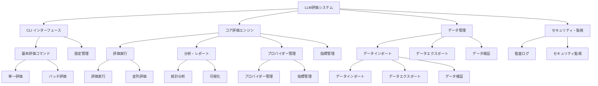
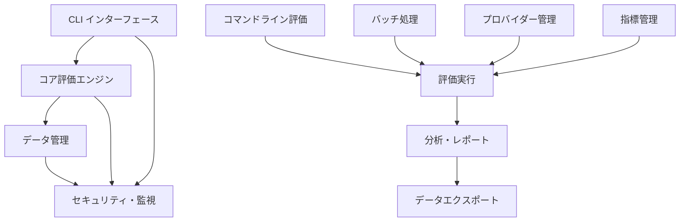
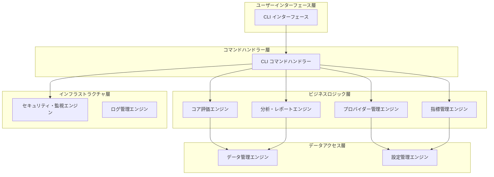
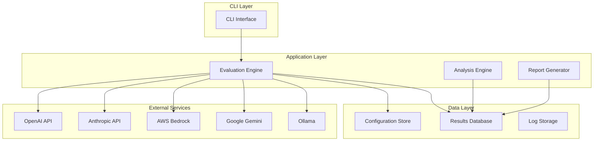

# 構造化マルチプロバイダー LLM 評価システム - 要求定義・要件定義書

## 文書情報

| 項目       | 内容                                                           |
| ---------- | -------------------------------------------------------------- |
| 文書名     | 構造化マルチプロバイダー LLM 評価システム 要求定義・要件定義書 |
| バージョン | 1.0                                                            |
| 作成日     | 2025 年 9 月 27 日                                             |
| 作成者     | AI 開発チーム                                                  |
| 承認者     | プロジェクトマネージャー                                       |
| ステータス | 草案                                                           |

## 目次

1. [プロジェクト概要](#1-プロジェクト概要)
2. [ステークホルダー分析](#2-ステークホルダー分析)
3. [ビジネス要求](#3-ビジネス要求)
4. [機能要件](#4-機能要件)
5. [非機能要件](#5-非機能要件)
6. [技術要件](#6-技術要件)
7. [制約事項](#7-制約事項)
8. [受け入れ基準](#8-受け入れ基準)
9. [リスク分析](#9-リスク分析)
10. [付録](#10-付録)

---

## 1. プロジェクト概要

### 1.1 プロジェクト名

構造化マルチプロバイダー LLM 評価システム（Structured Multi-Provider LLM Evaluation System）

### 1.2 プロジェクト目的

情報公開法に基づいて行政機関の保有する情報の非開示が適切かどうかを正確に評価するための包括的なフレームワークを構築する。LLM への入力（プロンプト）、コンテキスト、出力を基に、情報公開法の評価基準に従って出力内容を評価し、ユーザーが自由に選択できる複数の LLM プロバイダーに対応することで、一貫した評価プロセスを実現する。

### 1.3 ドメイン駆動設計（DDD）アプローチ

#### 1.3.1 ユビキタス言語（Ubiquitous Language）

- **評価（Evaluation）**: LLM 出力の品質を測定するプロセス
- **評価指標（Evaluation Metric）**: 品質を測定する基準
- **プロバイダー（Provider）**: LLM サービス提供者
- **評価結果（Evaluation Result）**: 構造化された評価データ
- **評価エンジン（Evaluation Engine）**: 評価を実行するコアコンポーネント

#### 1.3.2 境界づけられたコンテキスト（Bounded Context）

- **評価コンテキスト**: 評価指標の定義と実行
- **プロバイダーコンテキスト**: LLM プロバイダーの管理
- **分析コンテキスト**: 評価結果の分析と可視化
- **レポートコンテキスト**: レポート生成と配信

#### 1.3.3 戦略的パターン

- **コアドメイン**: 評価エンジン、評価指標管理
- **サポートドメイン**: プロバイダー管理、レポート生成
- **ジェネリックドメイン**: ログ管理、設定管理

### 1.4 プロジェクトスコープ

- **対象範囲**: OpenAI、Anthropic、AWS Bedrock、Google Gemini、Ollama の 5 つの主要 LLM プロバイダー
- **評価対象**: LLM の出力品質（関連性、一貫性、有用性、事実性、創造性、安全性、バイアス、簡潔性）
- **出力形式**: 構造化された評価結果（HTML、JSON、可視化レポート）
- **対象ドメイン**: 汎用評価から医療、法務、技術、学術、クリエイティブ分野まで

### 1.5 期待される成果

- 情報公開法に基づく情報非開示の適切性を定量的に測定できる評価システム
- 情報公開法の評価基準に基づく一貫した評価プロセス
- 複数プロバイダーからの自由な選択による柔軟な評価
- 構造化された評価結果による情報非開示の客観的判定

### 1.6 アーキテクチャ決定記録（ADR）

#### ADR-001: ヘキサゴナルアーキテクチャの採用

**決定**: ヘキサゴナルアーキテクチャ（ポート・アダプターパターン）を採用
**理由**:

- ドメインロジックの独立性確保
- 外部依存関係の分離
- テスタビリティの向上
- 将来の技術変更への対応

#### ADR-002: 構造化ログの採用

**決定**: OpenTelemetry + JSON 形式の構造化ログを採用
**理由**:

- 分散トレーシングの実現
- ログ分析の自動化
- セキュリティ要件（PII 保護）の遵守
- 運用監視の効率化

---

## 2. ステークホルダー分析

### 2.1 主要ステークホルダー

#### 2.1.1 ビジネスステークホルダー

| ステークホルダー       | 役割         | 要求事項                                                                         | 優先度 |
| ---------------------- | ------------ | -------------------------------------------------------------------------------- | ------ |
| **プロダクトオーナー** | 製品戦略決定 | ・情報公開法準拠の評価精度向上<br>・行政機関の業務効率化<br>・法的リスクの軽減   | 高     |
| **経営陣**             | 投資判断     | ・コンプライアンス強化<br>・法的リスク管理<br>・行政機関との信頼関係構築         | 高     |
| **ビジネスアナリスト** | 要件分析     | ・情報公開法の評価基準整備<br>・データドリブン意思決定<br>・評価プロセスの標準化 | 中     |

#### 2.1.2 技術ステークホルダー

| ステークホルダー      | 役割         | 要求事項                                                                       | 優先度 |
| --------------------- | ------------ | ------------------------------------------------------------------------------ | ------ |
| **開発チーム**        | システム開発 | ・情報公開法評価ロジックの実装<br>・法的要件の技術的実現<br>・セキュリティ強化 | 高     |
| **アーキテクト**      | 技術設計     | ・法的要件準拠のアーキテクチャ<br>・データ保護・暗号化<br>・監査ログ機能       | 高     |
| **DevOps エンジニア** | 運用管理     | ・セキュアなデプロイ<br>・法的要件に基づく監視<br>・インシデント対応           | 中     |

#### 2.1.3 エンドユーザー

| ステークホルダー   | 役割         | 要求事項                                                           | 優先度 |
| ------------------ | ------------ | ------------------------------------------------------------------ | ------ |
| **行政機関職員**   | 情報公開担当 | ・情報公開法準拠の評価<br>・法的根拠の明確化<br>・評価結果の信頼性 | 高     |
| **法務担当者**     | 法的検証     | ・法的要件の技術的実現<br>・判例・法令の反映<br>・リスク評価機能   | 高     |
| **システム管理者** | 運用管理     | ・セキュリティ機能<br>・監査ログ<br>・障害対応機能                 | 中     |

### 2.2 ステークホルダーマトリクス

#### 2.2.1 影響度 vs 関心度マトリクス

```
高影響度・高関心度: プロダクトオーナー、開発チーム、行政機関職員
高影響度・低関心度: 経営陣、アーキテクト
低影響度・高関心度: 法務担当者、システム管理者
低影響度・低関心度: ビジネスアナリスト、DevOpsエンジニア
```

#### 2.2.2 コミュニケーション戦略

- **高影響度・高関心度**: 週次レビュー、直接コミュニケーション
- **高影響度・低関心度**: 月次レポート、意思決定時の相談
- **低影響度・高関心度**: 定期的なフィードバック収集
- **低影響度・低関心度**: 必要時のみ情報提供

---

## 3. ビジネス要求

### 3.1 戦略的要求

#### 3.1.1 ビジネス目標

- **主要目標**: 情報公開法に基づく情報非開示の適切性評価による法的コンプライアンス向上
- **副次目標**: 行政機関の業務効率化、評価コストの削減、評価時間の短縮
- **長期目標**: 情報公開法準拠の評価フレームワークの業界標準化

#### 3.1.2 成功指標（KPI）

| 指標                 | 目標値       | 測定方法                   | 期間    |
| -------------------- | ------------ | -------------------------- | ------- |
| 法的評価精度向上     | 95%以上      | 法務専門家評価との相関分析 | 3 ヶ月  |
| 評価時間短縮         | 80%削減      | 従来手法との比較           | 6 ヶ月  |
| コンプライアンス向上 | 90%以上      | 法的要件準拠率分析         | 12 ヶ月 |
| 行政機関満足度       | 4.5/5.0 以上 | 行政機関ユーザー調査       | 継続的  |

### 3.2 機能的要求

#### 3.2.1 コア機能要求

1. **マルチプロバイダー対応**

   - 5 つの主要 LLM プロバイダーへの対応
   - ユーザーが自由に選択できるプロバイダー設定
   - 一貫した評価プロセスの提供

2. **構造化評価**

   - Pydantic モデルによる型安全な評価結果
   - 一貫した評価フォーマット
   - 指定された評価基準に基づく評価メトリクス

3. **柔軟な評価指標システム**
   - **標準評価指標**: 汎用的な品質評価（正確性、包括性、関連性、明確性、有用性、一貫性、適切性）
   - **ドメイン特化指標**: 医療、法務、技術、学術、クリエイティブ分野の専門評価
   - **カスタム指標**: JSON ベースの評価指標定義による完全カスタマイズ
   - **評価基準の指定**: ユーザーが指定した評価基準に基づく出力品質判定
   - **法的評価指標**: 情報公開法準拠の行政情報評価（個人情報保護、法人情報保護、国家安全保障等）
   - **情報公開法評価基準**: 6 つの具体的な不開示事由に基づく評価（個人情報保護、法人等情報保護、国家安全保障、公共の安全と秩序、内部審議等、行政運営等）
   - **重み付け評価**: 評価指標の重要度に応じた重み付け機能
   - **段階的評価**: 多段階評価プロセスによる詳細分析

#### 3.2.2 分析・レポート機能

1. **自動分析機能**

   - 評価実行後の自動詳細分析
   - 評価スコアの統計分析
   - 分布分析とトレンド分析の自動実行
   - 時系列分析機能

2. **レポート生成機能**

   - 評価結果のレポート生成
   - 統計データの出力
   - 評価結果の構造化

3. **レポート生成**

   - **JSON 形式**: 構造化された評価データとメタデータ

   - 評価実行後のレポート生成

### 3.3 非機能的要求

#### 3.3.1 パフォーマンス要求

| 項目           | 要求値               | 測定方法             |
| -------------- | -------------------- | -------------------- |
| 評価処理時間   | 1 件あたり 30 秒以内 | ベンチマークテスト   |
| 同時処理数     | 100 件以上           | 負荷テスト           |
| レスポンス時間 | CLI 応答 5 秒以内    | パフォーマンステスト |
| スループット   | 1000 件/時間以上     | 負荷テスト           |

#### 3.3.2 可用性要求

- **稼働率**: 99.5%以上
- **データバックアップ**: 日次自動バックアップ
- **災害復旧**: 24 時間以内の復旧

#### 3.3.3 セキュリティ要求

- **データ暗号化**: 保存時・転送時の暗号化
- **アクセス制御**: ファイルシステムレベルでのアクセス制御
- **監査ログ**: 全操作のログ記録
- **プライバシー保護**: 個人情報の匿名化

---

## 4. 機能要件

### 4.1 システム機能マップ

#### 4.1.1 機能階層図



#### 4.1.2 機能詳細マップ

##### 4.1.2.1 CLI インターフェース機能群

| 機能             | サブ機能         | 説明                               | 優先度 | インターフェース |
| ---------------- | ---------------- | ---------------------------------- | ------ | ---------------- |
| **評価コマンド** | 単一評価         | コマンドラインでの単一評価実行     | 高     | CLI              |
|                  | バッチ評価       | コマンドラインでのバッチ評価実行   | 高     | CLI              |
| **設定管理**     | プロバイダー設定 | コマンドラインでのプロバイダー設定 | 高     | CLI              |

##### 4.1.2.2 コア評価エンジン機能群

| 機能                 | サブ機能         | 説明                         | 優先度 | インターフェース |
| -------------------- | ---------------- | ---------------------------- | ------ | ---------------- |
| **評価実行**         | プロンプト評価   | プロンプトの品質評価         | 高     | 内部 API         |
|                      | 回答評価         | LLM 回答の品質評価           | 高     | 内部 API         |
|                      | コンテキスト評価 | コンテキスト依存の評価       | 中     | 内部 API         |
|                      | 並列評価         | 複数評価の並列実行           | 高     | 内部 API         |
| **分析・レポート**   | 統計分析         | 評価結果の統計分析           | 高     | 内部 API         |
|                      | 比較分析         | プロバイダー間の比較分析     | 高     | 内部 API         |
|                      | 可視化           | 評価結果の可視化             | 高     | 内部 API         |
|                      | 予測分析         | 性能予測とトレンド分析       | 低     | 内部 API         |
| **プロバイダー管理** | プロバイダー登録 | LLM プロバイダーの登録と管理 | 高     | 内部 API         |
|                      | 接続管理         | プロバイダー接続の管理       | 高     | 内部 API         |
|                      | 設定管理         | プロバイダー設定の管理       | 高     | 内部 API         |
| **指標管理**         | 標準指標         | 7 つの主要評価指標の管理     | 高     | 内部 API         |
|                      | カスタム指標     | ユーザー定義指標の管理       | 高     | 内部 API         |
|                      | 指標検証         | 指標定義の妥当性検証         | 中     | 内部 API         |

##### 4.1.2.4 設定管理機能群

| 機能                 | サブ機能           | 説明                                                         | 優先度 |
| -------------------- | ------------------ | ------------------------------------------------------------ | ------ |
| **プロバイダー設定** | プロバイダー登録   | OpenAI、Anthropic、AWS Bedrock、Google Gemini、Ollama の設定 | 高     |
|                      | API キー管理       | セキュアな API キー保存と管理                                | 高     |
|                      | 接続テスト         | プロバイダー接続の検証                                       | 中     |
|                      | 設定テンプレート   | 事前定義された設定テンプレート                               | 低     |
| **評価指標設定**     | 標準指標管理       | 7 つの主要評価指標の設定                                     | 高     |
|                      | カスタム指標作成   | JSON ベースのカスタム指標定義                                | 高     |
|                      | 指標テンプレート   | ドメイン特化型指標テンプレート                               | 中     |
|                      | 指標検証           | 指標定義の妥当性検証                                         | 中     |
| **システム設定**     | 一般設定           | システム全体の基本設定                                       | 中     |
|                      | パフォーマンス設定 | 並列処理、タイムアウト設定                                   | 中     |
|                      | 通知設定           | アラート・通知の設定                                         | 低     |
| **ユーザー管理**     | ユーザー登録       | ユーザーアカウントの作成・管理                               | 高     |
|                      | 権限管理           | ロールベースアクセス制御                                     | 高     |
|                      | セッション管理     | ユーザーセッションの管理                                     | 中     |

##### 4.1.2.2 評価実行機能群

| 機能                 | サブ機能           | 説明                         | 優先度 |
| -------------------- | ------------------ | ---------------------------- | ------ |
| **単一評価**         | プロンプト評価     | 単一プロンプトの評価実行     | 高     |
|                      | 回答評価           | LLM 回答の品質評価           | 高     |
|                      | コンテキスト評価   | コンテキスト依存の評価       | 中     |
|                      | 即座評価           | リアルタイム評価実行         | 中     |
| **バッチ評価**       | 並列処理           | 複数評価の並列実行           | 高     |
|                      | 進捗監視           | 評価進捗のリアルタイム監視   | 高     |
|                      | エラーハンドリング | 評価エラーの処理と復旧       | 高     |
|                      | スケジューリング   | 評価タスクのスケジューリング | 中     |
| **比較評価**         | プロバイダー比較   | 複数プロバイダー間の性能比較 | 高     |
|                      | 指標比較           | 異なる評価指標での比較       | 高     |
|                      | 時系列比較         | 時間経過による性能変化の比較 | 中     |
|                      | ベンチマーク比較   | 標準ベンチマークとの比較     | 中     |
| **カスタム評価**     | カスタム指標評価   | ユーザー定義指標での評価     | 高     |
|                      | ドメイン特化評価   | 特定ドメイン向け評価         | 中     |
|                      | 複合評価           | 複数指標の組み合わせ評価     | 中     |
|                      | 重み付け評価       | 指標の重み付けによる評価     | 中     |
| **リアルタイム評価** | ストリーミング評価 | リアルタイムでの評価実行     | 中     |
|                      | 即座フィードバック | 評価結果の即座表示           | 中     |
|                      | 動的調整           | 評価パラメータの動的調整     | 低     |

##### 4.1.2.3 分析・レポート機能群

| 機能             | サブ機能               | 説明                                    | 優先度 |
| ---------------- | ---------------------- | --------------------------------------- | ------ |
| **統計分析**     | 記述統計               | 平均、中央値、標準偏差等の計算          | 高     |
|                  | 推論統計               | 仮説検定、信頼区間の計算                | 中     |
|                  | 相関分析               | 指標間の相関関係分析                    | 中     |
|                  | 回帰分析               | 性能予測モデルの構築                    | 低     |
| **比較分析**     | プロバイダー比較       | プロバイダー間の性能比較                | 高     |
|                  | 指標比較               | 評価指標間の比較分析                    | 高     |
|                  | 時系列分析             | 時間経過による性能変化分析              | 中     |
|                  | ベンチマーク分析       | 標準ベンチマークとの比較                | 中     |
| **レポート生成** | HTML レポート          | インタラクティブな HTML レポート        | 高     |
|                  | PDF レポート           | 印刷用 PDF レポート                     | 高     |
|                  | JSON レポート          | 構造化データレポート                    | 中     |
|                  | カスタムレポート       | ユーザー定義レポート                    | 中     |
| **可視化**       | インタラクティブ可視化 | Plotly ベースのインタラクティブチャート | 高     |
|                  | 静的チャート           | 画像形式の静的チャート                  | 高     |
|                  | ダッシュボード         | 統合ダッシュボード                      | 高     |
|                  | リアルタイム可視化     | リアルタイムデータの可視化              | 中     |
| **予測分析**     | 性能予測               | 将来の性能予測                          | 低     |
|                  | 異常検知               | 性能異常の検知                          | 低     |
|                  | トレンド分析           | 長期トレンドの分析                      | 低     |

##### 4.1.2.4 データ管理機能群

| 機能                   | サブ機能           | 説明                         | 優先度 |
| ---------------------- | ------------------ | ---------------------------- | ------ |
| **データインポート**   | CSV インポート     | CSV 形式データのインポート   | 高     |
|                        | JSON インポート    | JSON 形式データのインポート  | 高     |
|                        | Excel インポート   | Excel 形式データのインポート | 中     |
|                        | API インポート     | 外部 API からのデータ取得    | 中     |
| **データエクスポート** | CSV エクスポート   | 評価結果の CSV 出力          | 高     |
|                        | JSON エクスポート  | 評価結果の JSON 出力         | 高     |
|                        | Excel エクスポート | 評価結果の Excel 出力        | 中     |
|                        | PDF エクスポート   | 評価結果の PDF 出力          | 中     |
| **データ検証**         | 形式検証           | データ形式の妥当性検証       | 高     |
|                        | 内容検証           | データ内容の妥当性検証       | 高     |
|                        | 整合性検証         | データ間の整合性検証         | 中     |
|                        | 品質検証           | データ品質の検証             | 中     |
| **データクレンジング** | 重複除去           | 重複データの除去             | 中     |
|                        | 欠損値処理         | 欠損データの処理             | 中     |
|                        | 異常値検出         | 異常データの検出と処理       | 中     |
|                        | 正規化             | データの正規化処理           | 低     |
| **データアーカイブ**   | 自動アーカイブ     | 古いデータの自動アーカイブ   | 低     |
|                        | 圧縮保存           | データの圧縮保存             | 低     |
|                        | 削除ポリシー       | データ削除ポリシーの適用     | 低     |

##### 4.1.2.5 セキュリティ・監視機能群

| 機能                   | サブ機能         | 説明                            | 優先度 |
| ---------------------- | ---------------- | ------------------------------- | ------ |
| **認証・認可**         | ユーザー認証     | 多要素認証によるユーザー認証    | 高     |
|                        | 権限管理         | ロールベースアクセス制御        | 高     |
|                        | セッション管理   | セキュアなセッション管理        | 高     |
| **監査ログ**           | 操作ログ         | 全操作のログ記録                | 高     |
|                        | アクセスログ     | アクセス履歴の記録              | 高     |
|                        | エラーログ       | エラー・例外のログ記録          | 高     |
|                        | セキュリティログ | セキュリティ関連イベントの記録  | 高     |
| **セキュリティ監視**   | 異常検知         | セキュリティ異常の検知          | 中     |
|                        | 侵入検知         | 不正アクセスの検知              | 中     |
|                        | 脆弱性監視       | システム脆弱性の監視            | 中     |
|                        | 脅威分析         | セキュリティ脅威の分析          | 低     |
| **パフォーマンス監視** | リソース監視     | CPU、メモリ、ディスク使用量監視 | 高     |
|                        | 応答時間監視     | API 応答時間の監視              | 高     |
|                        | スループット監視 | 処理スループットの監視          | 中     |
|                        | アラート設定     | パフォーマンス閾値のアラート    | 中     |

#### 4.1.3 機能間の依存関係



#### 4.1.4 インターフェース別機能マッピング

##### 4.1.4.1 CLI インターフェース機能

| 機能カテゴリ | CLI コマンド例                                             | 説明             | 優先度 |
| ------------ | ---------------------------------------------------------- | ---------------- | ------ |
| **評価実行** | `llm-eval single --prompt "..." --provider openai`         | 単一評価の実行   | 高     |
|              | `llm-eval batch --file data.csv --provider openai`         | バッチ評価の実行 | 高     |
| **設定管理** | `llm-eval config provider add --name openai --api-key ...` | プロバイダー設定 | 高     |
|              | `llm-eval config show`                                     | 設定確認         | 中     |

##### 4.1.4.2 コア評価エンジン機能

| 機能カテゴリ         | 内部 API                                | 説明                   | 優先度 |
| -------------------- | --------------------------------------- | ---------------------- | ------ |
| **評価実行**         | `EvaluationEngine.evaluate_single()`    | 単一評価の実行         | 高     |
|                      | `EvaluationEngine.evaluate_batch()`     | バッチ評価の実行       | 高     |
| **分析・レポート**   | `AnalysisEngine.calculate_statistics()` | 統計分析の実行         | 高     |
|                      | `AnalysisEngine.create_visualization()` | 可視化の生成           | 高     |
| **プロバイダー管理** | `ProviderManager.register_provider()`   | プロバイダーの登録     | 高     |
|                      | `ProviderManager.test_connection()`     | 接続テストの実行       | 高     |
|                      | `ProviderManager.get_providers()`       | プロバイダー一覧の取得 | 高     |
| **指標管理**         | `MetricManager.load_metrics()`          | 評価指標の読み込み     | 高     |
|                      | `MetricManager.validate_metric()`       | 指標の妥当性検証       | 中     |
|                      | `MetricManager.get_metrics()`           | 指標一覧の取得         | 高     |

#### 4.1.5 機能の優先度マトリクス

| 機能カテゴリ             | 高優先度                                         | 中優先度 | 低優先度 |
| ------------------------ | ------------------------------------------------ | -------- | -------- |
| **CLI インターフェース** | 評価コマンド、設定管理                           | -        | -        |
| **コア評価エンジン**     | 評価実行、分析・レポート、プロバイダー管理       | 指標管理 | 予測分析 |
| **データ管理**           | データインポート、データエクスポート、データ検証 | -        | -        |
| **セキュリティ・監視**   | 監査ログ、セキュリティ監視                       | -        | -        |

#### 4.1.6 インターフェース統合アーキテクチャ



#### 4.1.7 使用シナリオ別機能マッピング

##### 4.1.7.1 CLI 使用シナリオ

| シナリオ       | 主要機能             | コマンド例                                         | 出力形式 |
| -------------- | -------------------- | -------------------------------------------------- | -------- |
| **評価**       | 単一評価、バッチ評価 | `llm-eval single --prompt "..." --provider openai` | JSON     |
| **バッチ処理** | バッチ評価           | `llm-eval batch --file data.csv --provider openai` | JSON     |

#### 4.1.8 ユーザー体験パターン別詳細

##### 4.1.8.1 CLI ユーザー体験パターン

###### **パターン 1: 評価**

```
【ユーザー】: 開発者・研究者
【目的】: LLM の性能を確認したい
【体験フロー】:
1. ターミナルでコマンド実行
   $ llm-eval single --prompt "Pythonの関数を書いて" --provider openai
2. 評価結果を即座に確認
   → JSON形式で結果表示

【期待される体験】:
- コマンド1つで評価実行
- 結果の即座確認
- シンプルな操作
```

###### **パターン 2: バッチ処理**

```
【ユーザー】: データサイエンティスト
【目的】: 複数データの一括評価
【体験フロー】:
1. バッチ評価の実行
   $ llm-eval batch --file test_data.csv --provider openai
2. 結果の確認
   → JSON形式で結果表示

【期待される体験】:
- シンプルなバッチ処理
- 明確な結果表示
- エラー時の適切な通知
```

##### 4.1.8.2 エラーハンドリングとユーザー体験

###### **CLI エラー体験**

```
【エラー発生時】:
1. 明確なエラーメッセージの表示
   Error: Provider 'invalid_provider' not found
   Available providers: openai, anthropic, claude
2. 解決策の提示
   Hint: Use 'llm-eval config provider list' to see available providers
3. 詳細情報の提供
   $ llm-eval --help
   $ llm-eval config --help

【期待される体験】:
- 分かりやすいエラーメッセージ
- 具体的な解決策の提示
- 詳細なヘルプ情報
- デバッグに必要な情報の提供
```

### 4.2 詳細機能要件

#### 4.2.1 設定管理機能

**REQ-001: プロバイダー設定管理**

- **機能**: 複数 LLM プロバイダーの設定と管理
- **詳細**:
  - OpenAI、Anthropic、AWS Bedrock、Google Gemini、Ollama の設定
  - API キー管理とセキュアな保存
  - プロバイダー固有のパラメータ設定
- **入力**: プロバイダー設定情報
- **出力**: 設定済みプロバイダー情報
- **優先度**: 高
- **BDD シナリオ**:

  ```gherkin
  Feature: プロバイダー設定管理

  Background:
    Given システムが初期化されている

  Scenario: 新しいプロバイダーを追加する
    Given 管理者がプロバイダー設定画面にアクセスする
    When 新しいプロバイダー情報を入力する
    And APIキーを設定する
    Then プロバイダーが正常に登録される
    And 設定がセキュアに保存される
  ```

**REQ-002: 柔軟な評価指標管理**

- **機能**: 多様な評価指標の定義と管理
- **詳細**:
  - **標準評価指標**: 汎用的な品質評価（正確性、包括性、関連性、明確性、有用性、一貫性、適切性）
  - **ドメイン特化指標**: 医療、法務、技術、学術、クリエイティブ分野の専門評価
  - **カスタム指標**: JSON ベースの評価指標定義による完全カスタマイズ
  - **法的評価指標**: 情報公開法準拠の行政情報評価
  - **情報公開法評価基準**: 6 つの具体的な不開示事由に基づく評価
    - **個人情報保護** (第 5 条第 1 号): 個人の権利利益保護のための不開示判断
    - **法人等情報保護** (第 5 条第 2 号): 法人等の競争上の地位と正当な利益保護
    - **国家安全保障** (第 5 条第 3 号): 国の安全と国際関係保護
    - **公共の安全と秩序** (第 5 条第 4 号): 法執行と公共安全保護
    - **内部審議等** (第 5 条第 5 号): 率直な意見交換と意思決定の中立性保護
    - **行政運営等** (第 5 条第 6 号): 適正な事務遂行の保護
  - **重み付け機能**: 評価指標の重要度に応じた重み付け
  - **段階的評価**: 多段階評価プロセスによる詳細分析
- **入力**: 評価指標定義（JSON 形式）
- **出力**: 設定済み評価指標
- **優先度**: 高

**REQ-003: プロンプト管理**

- **機能**: 評価用プロンプトの管理
- **詳細**:
  - プロンプトテンプレートの管理
  - ドメイン特化プロンプト
  - プロンプトバージョン管理
- **入力**: プロンプトテンプレート
- **出力**: 評価用プロンプト
- **優先度**: 中

#### 4.2.2 評価エンジン機能

**REQ-004: データ入力処理**

- **機能**: 評価対象データの入力と検証
- **詳細**:
  - CSV、JSON、Excel 形式のデータ入力
  - データ品質検証
  - データ前処理
- **入力**: 評価対象データ
- **出力**: 検証済みデータ
- **優先度**: 高

**REQ-005: 評価実行**

- **機能**: LLM 評価の実行
- **詳細**:
  - 並列評価処理
  - エラーハンドリング
  - 進捗管理
- **入力**: 評価対象データ、評価設定
- **出力**: 評価結果
- **優先度**: 高

**REQ-006: 結果処理**

- **機能**: 評価結果の処理と構造化
- **詳細**:
  - 結果の集計と統計処理
  - 構造化データの生成
  - 結果の検証
- **入力**: 生評価結果
- **出力**: 構造化評価結果
- **優先度**: 高

#### 4.2.3 分析・レポート機能

**REQ-007: 統計分析**

- **機能**: 評価結果の統計分析
- **詳細**:
  - 基本統計量の計算
  - 分布分析
  - 相関分析
- **入力**: 評価結果データ
- **出力**: 統計分析結果
- **優先度**: 高

**REQ-008: 比較分析**

- **機能**: プロバイダー間の性能比較
- **詳細**:
  - プロバイダー別性能比較
  - 時系列比較
  - ベンチマーク比較
- **入力**: 複数プロバイダーの評価結果
- **出力**: 比較分析結果
- **優先度**: 高

**REQ-009: レポート生成**

- **機能**: 評価レポートの生成
- **詳細**:
  - JSON 形式での出力
  - レポートテンプレート
- **入力**: 分析結果
- **出力**: 評価レポート
- **優先度**: 中

#### 4.2.4 可視化機能

**REQ-010: 可視化**

- **機能**: 可視化の提供
- **詳細**:
  - チャート生成
  - 統計グラフ
- **入力**: 評価結果データ
- **出力**: 可視化
- **優先度**: 低

#### 4.2.5 情報公開法評価機能

**REQ-011: 情報公開法評価基準の実装**

- **機能**: 情報公開法に基づく 6 つの不開示事由の評価
- **詳細**:
  - **個人情報保護評価** (第 5 条第 1 号)
    - 個人の特定可能性の確認
    - 開示例外要件の適用
    - プライバシー権と公益のバランス考慮
  - **法人等情報保護評価** (第 5 条第 2 号)
    - 法人等情報の特定と分類
    - 競争上の地位への影響評価
    - 法人利益と公益のバランス考慮
  - **国家安全保障評価** (第 5 条第 3 号)
    - 国の安全への影響評価
    - 国際関係への影響評価
    - 専門機関との協議実施
  - **公共の安全と秩序評価** (第 5 条第 4 号)
    - 法執行への影響評価
    - 公共の安全と秩序への影響評価
    - 法執行機関との連携
  - **内部審議等評価** (第 5 条第 5 号)
    - 内部審議情報の特定と分類
    - 意思決定プロセスへの影響評価
    - 透明性と保護のバランス考慮
  - **行政運営等評価** (第 5 条第 6 号)
    - 行政運営情報の特定と分類
    - 事務遂行への影響評価
    - 効率性と透明性のバランス考慮
- **入力**: 評価対象情報、評価基準設定
- **出力**: 構造化された評価結果（1-5 スケール、段階的判断、根拠）
- **優先度**: 高
- **BDD シナリオ**:

  ```gherkin
  Feature: 情報公開法評価基準の適用

  Background:
    Given 情報公開法評価基準が設定されている
    And 評価対象の行政情報が提供されている

  Scenario: 個人情報保護評価の実行
    Given 個人情報を含む行政情報が提供される
    When 個人情報保護評価を実行する
    Then 個人の特定可能性が評価される
    And 開示例外要件が適用される
    And 1-5スケールでスコアが算出される
    And 不開示/開示を検討/開示の判断が出力される
  ```

### 4.3 データ要件

#### 4.3.1 入力データ要件

| 項目                     | 要件              | 詳細                 |
| ------------------------ | ----------------- | -------------------- |
| **データ形式**           | CSV、JSON、Excel  | 複数形式に対応       |
| **必須フィールド**       | question、answer  | 評価対象の質問と回答 |
| **オプションフィールド** | metadata、context | 追加情報             |
| **データサイズ**         | 最大 10MB         | 単一ファイルあたり   |
| **文字エンコーディング** | UTF-8             | 国際化対応           |

#### 4.3.2 評価指標データ要件

| 項目               | 要件                      | 詳細                             |
| ------------------ | ------------------------- | -------------------------------- |
| **指標定義形式**   | JSON                      | 構造化された評価指標定義         |
| **必須フィールド** | name、description、weight | 指標名、説明、重み付け           |
| **評価プロンプト** | evaluation_prompt         | 詳細な評価指示とプロンプト       |
| **段階的評価**     | evaluation_steps          | 多段階評価プロセスの定義         |
| **スコア解釈**     | category_criteria         | 1-5 スケールのスコア解釈         |
| **具体例**         | examples                  | 各スコアレベルの具体例と評価結果 |
| **参考情報**       | reference_text            | 法的根拠や参考資料               |
| **重み付け**       | weight                    | 評価指標の重要度（0.0-1.0）      |

#### 4.3.3 情報公開法評価基準データ要件

| 項目                 | 要件                      | 詳細                                       |
| -------------------- | ------------------------- | ------------------------------------------ |
| **基準定義形式**     | JSON                      | 情報公開法第 5 条に基づく 6 つの不開示事由 |
| **必須フィールド**   | name、description、weight | 基準名、説明、重み付け                     |
| **評価プロンプト**   | evaluation_prompt         | 段階的評価手順とプロンプト                 |
| **評価ガイドライン** | evaluation_guidelines     | 全体的評価方針と意思決定プロセス           |
| **スコア解釈**       | scoring_interpretation    | 1-5 スケールのスコア解釈                   |
| **評価ステップ**     | evaluation_steps          | 具体的な評価ステップの定義                 |
| **具体例**           | examples                  | 各スコアレベルの具体例と評価結果           |
| **参考条文**         | reference_text            | 情報公開法の該当条文                       |
| **重み付け**         | weight                    | 評価基準の重要度（0.0-1.0）                |

#### 4.3.4 出力データ要件

| 項目         | 要件        | 詳細                |
| ------------ | ----------- | ------------------- |
| **評価結果** | 構造化 JSON | Pydantic モデル準拠 |
| **統計情報** | 数値データ  | 計算済み統計量      |
| **レポート** | JSON        | 構造化データ形式    |

---

## 5. 非機能要件

### 5.1 パフォーマンス要件

#### 5.1.1 レスポンス時間要件

| 機能                 | 目標値               | 測定条件          |
| -------------------- | -------------------- | ----------------- |
| **CLI 応答時間**     | 5 秒以内             | 通常負荷時        |
| **評価処理時間**     | 1 件あたり 30 秒以内 | 標準的な評価指標  |
| **レポート生成時間** | 5 分以内             | 1000 件の評価結果 |

#### 5.1.2 スループット要件

| 機能                 | 目標値      | 測定条件           |
| -------------------- | ----------- | ------------------ |
| **同時評価数**       | 100 件以上  | 並列処理時         |
| **時間あたり処理数** | 1000 件以上 | 継続処理時         |
| **データ処理量**     | 1GB/時間    | 大容量データ処理時 |

#### 5.1.3 リソース使用量要件

| リソース             | 目標値       | 測定条件               |
| -------------------- | ------------ | ---------------------- |
| **メモリ使用量**     | 4GB 以下     | 通常処理時             |
| **CPU 使用率**       | 80%以下      | ピーク時               |
| **ディスク使用量**   | 10GB 以下    | ログ・一時ファイル含む |
| **ネットワーク帯域** | 100Mbps 以下 | 通常処理時             |

### 5.2 可用性要件

#### 5.2.1 稼働率要件

- **目標稼働率**: 99.5%以上（CLI ツールとして）
- **障害復旧**: 24 時間以内の完全復旧

#### 5.2.2 障害対応要件

| 障害レベル   | 対応時間    | 復旧時間    |
| ------------ | ----------- | ----------- |
| **Critical** | 15 分以内   | 1 時間以内  |
| **High**     | 1 時間以内  | 4 時間以内  |
| **Medium**   | 4 時間以内  | 24 時間以内 |
| **Low**      | 24 時間以内 | 72 時間以内 |

### 5.3 セキュリティ要件

#### 5.3.1 データ保護要件

- **暗号化**: AES-256 による保存時暗号化、TLS 1.3 による転送時暗号化
- **アクセス制御**: ファイルシステムレベルでのアクセス制御
- **監査**: 全操作のログ記録と監査証跡の保持

#### 5.3.2 プライバシー保護要件

- **個人情報**: GDPR、CCPA 準拠の個人情報保護
- **データ匿名化**: 評価データの匿名化処理
- **データ保持**: 必要最小限のデータ保持期間
- **データ削除**: 安全なデータ削除機能

### 5.4 拡張性要件

#### 5.4.1 水平拡張性

- **データ量**: 1TB までのデータ処理
- **同時処理**: 1000 件の同時評価処理

#### 5.4.2 垂直拡張性

- **CPU**: 32 コアまでの対応
- **メモリ**: 128GB までの対応
- **ストレージ**: 10TB までの対応
- **ネットワーク**: 10Gbps までの対応

### 5.5 互換性要件

#### 5.5.1 プラットフォーム互換性

- **OS**: Windows 10/11、macOS 10.15+、Ubuntu 20.04+
- **Python**: 3.8 以上

#### 5.5.2 データ互換性

- **入力形式**: CSV、JSON、Excel
- **出力形式**: JSON
- **データベース**: SQLite 対応

---

## 6. 技術要件

### 6.1 アーキテクチャ要件

#### 6.1.1 システムアーキテクチャ



#### 6.1.2 技術スタック

| レイヤー               | 技術        | バージョン | 理由                                 |
| ---------------------- | ----------- | ---------- | ------------------------------------ |
| **言語**               | Python      | 3.8+       | 豊富なライブラリ、AI/ML エコシステム |
| **CLI フレームワーク** | Click/Typer | 8.0+       | 高性能 CLI、型安全性、自動ヘルプ生成 |
| **データ処理**         | Pandas      | 1.5+       | データ分析、データ操作               |
| **機械学習**           | LangChain   | 0.1+       | LLM 統合、構造化出力                 |
| **可視化**             | Plotly      | 5.15+      | インタラクティブ可視化               |
| **データベース**       | SQLite      | 3.40+      | 軽量、ファイルベース                 |
| **監視**               | Prometheus  | 2.40+      | メトリクス収集                       |

#### 6.1.3 品質保証スタック

| カテゴリ             | ツール                  | 目的                       |
| -------------------- | ----------------------- | -------------------------- |
| **型安全性**         | mypy (strict)           | 静的型チェック             |
| **コード品質**       | Black + isort + flake8  | コードフォーマット・リント |
| **セキュリティ**     | bandit + safety         | セキュリティ脆弱性検出     |
| **テスト**           | pytest + pytest-asyncio | 単体テスト・統合テスト     |
| **プロパティテスト** | hypothesis              | プロパティベーステスト     |
| **カバレッジ**       | pytest-cov              | テストカバレッジ測定       |
| **ドキュメント**     | Sphinx + docstring      | 自動ドキュメント生成       |
| **アーキテクチャ**   | pytest-architecture     | アーキテクチャ制約検証     |

#### 6.1.4 情報公開法評価基準の実装要件

| 要件項目           | 実装詳細                             | 技術仕様                      |
| ------------------ | ------------------------------------ | ----------------------------- |
| **基準データ管理** | JSON 形式での評価基準定義            | Pydantic モデルによる型安全性 |
| **段階的評価**     | 3-4 段階の評価プロセス実装           | 条件分岐ロジック              |
| **スコア計算**     | 1-5 スケールでの重み付けスコア計算   | 数値計算エンジン              |
| **判断ロジック**   | 不開示/開示を検討/開示の三段階判断   | ルールエンジン                |
| **具体例管理**     | 各スコアレベルの具体例と評価結果管理 | データベース管理              |
| **参考条文管理**   | 情報公開法条文の参照管理             | 文書管理システム              |
| **評価履歴**       | 評価実行履歴と結果の保存             | 履歴管理システム              |
| **レポート生成**   | 評価結果の構造化レポート生成         | レポート生成エンジン          |

### 6.2 開発要件

#### 6.2.1 開発環境要件

- **IDE**: VS Code、PyCharm、Jupyter Notebook
- **バージョン管理**: Git、GitHub/GitLab
- **CI/CD**: GitHub Actions、GitLab CI
- **テスト**: pytest、unittest、coverage
- **品質管理**: Black、flake8、mypy、SonarQube

#### 6.2.2 コーディング規約

- **Python**: PEP 8 準拠、Black フォーマッター
- **型ヒント**: 全関数に型ヒント必須（mypy --strict）
- **ドキュメント**: Google Docstring 形式
- **テスト**: カバレッジ 80%以上（行）、70%以上（分岐）
- **セキュリティ**: OWASP Top 10 準拠
- **複雑度**: サイクロマティック複雑度 ≤10
- **認知複雑度**: ≤15
- **保守性指数**: ≥70

#### 6.2.3 構造化ログ要件

- **ログ形式**: JSON 形式（ELK/EFK スタック対応）
- **ログレベル**: FATAL/ERROR/WARN/INFO/DEBUG/TRACE（RFC 5424 準拠）
- **相関 ID**: リクエスト追跡のための相関 ID 必須
- **セキュリティ**: PII/認証情報のログ記録禁止
- **構造化**: 全ログを構造化 JSON 形式で出力

#### 6.2.4 エラーハンドリング要件

- **Result/Either パターン**: モナディックエラーハンドリング必須
- **サーキットブレーカー**: 外部サービス呼び出しの保護
- **リトライ**: 指数バックオフ付きリトライ
- **バリデーション**: 早期バリデーションと即座の失敗
- **禁止パターン**: サイレント失敗、汎用 catch-all、null 返却

### 6.3 運用要件

#### 6.3.1 デプロイ要件

- **コンテナ化**: Docker、Docker Compose
- **オーケストレーション**: Kubernetes（オプション）
- **環境**: 開発、ステージング、本番環境
- **設定管理**: 環境変数、設定ファイル

#### 6.3.2 監視・ログ要件

- **ログ**: 構造化ログ（JSON 形式）
- **メトリクス**: Prometheus、Grafana
- **アラート**: 重要度別アラート設定
- **トレーシング**: OpenTelemetry 対応

### 6.4 セキュリティ要件

#### 6.4.1 認証・認可

- **認証方式**: ファイルシステムレベルでのアクセス制御
- **認可**: ファイル権限ベースのアクセス制御
- **セッション管理**: CLI セッション管理

#### 6.4.2 データ保護

- **暗号化**: 保存時・転送時暗号化
- **バックアップ**: 暗号化されたバックアップ
- **データ削除**: 安全なデータ削除
- **監査**: 全操作の監査ログ

---

## 7. 制約事項

### 7.1 技術的制約

#### 7.1.1 外部依存制約

- **API 制限**: 各 LLM プロバイダーのレート制限
- **コスト制限**: API 呼び出しコストの制限
- **ネットワーク**: インターネット接続必須
- **ライセンス**: サードパーティライブラリのライセンス制約

#### 7.1.2 プラットフォーム制約

- **OS**: Linux、macOS、Windows 対応
- **Python**: 3.8 以上必須
- **メモリ**: 最小 4GB、推奨 8GB 以上
- **ストレージ**: 最小 10GB、推奨 50GB 以上

### 7.2 ビジネス制約

#### 7.2.1 コスト制約

- **開発コスト**: 予算内での開発完了
- **運用コスト**: 月額運用コストの制限
- **ライセンスコスト**: サードパーティライセンス費用
- **インフラコスト**: クラウド・オンプレミスコスト

#### 7.2.2 スケジュール制約

- **開発期間**: 6 ヶ月以内の開発完了
- **リリース**: 四半期ごとのリリース
- **テスト**: 2 週間のテスト期間
- **デプロイ**: 1 週間のデプロイ期間

### 7.3 法的制約

#### 7.3.1 データ保護法

- **GDPR**: EU 一般データ保護規則準拠
- **CCPA**: カリフォルニア州消費者プライバシー法準拠
- **個人情報保護法**: 日本の個人情報保護法準拠
- **データローカライゼーション**: データの保存場所制限

#### 7.3.2 知的財産権

- **オープンソース**: オープンソースライセンス準拠
- **特許**: 既存特許の侵害回避
- **商標**: 商標権の尊重
- **著作権**: 著作権法準拠

---

## 8. 受け入れ基準

### 8.1 機能受け入れ基準

#### 8.1.1 コア機能の受け入れ基準

| 機能                       | 受け入れ基準                           | テスト方法                   |
| -------------------------- | -------------------------------------- | ---------------------------- |
| **マルチプロバイダー対応** | 5 つのプロバイダーすべてで評価実行可能 | 各プロバイダーでの評価テスト |
| **構造化出力**             | Pydantic モデルによる型安全な出力      | 型チェックテスト             |
| **並列処理**               | 100 件の同時評価処理                   | 負荷テスト                   |
| **エラーハンドリング**     | エラー率 5%以下                        | エラーシナリオテスト         |
| **情報公開法評価**         | 6 つの不開示事由すべてで評価実行可能   | 各基準での評価テスト         |
| **段階的評価**             | 3-4 段階の評価プロセスが正常動作       | 段階的評価テスト             |
| **スコア計算**             | 1-5 スケールでの正確なスコア算出       | スコア計算テスト             |
| **判断ロジック**           | 不開示/開示を検討/開示の正確な判断     | 判断ロジックテスト           |

#### 8.1.2 品質要件の受け入れ基準

| 項目                         | 基準値     | 検証方法      |
| ---------------------------- | ---------- | ------------- |
| **テストカバレッジ**         | ≥80%（行） | pytest-cov    |
| **分岐カバレッジ**           | ≥70%       | pytest-cov    |
| **型カバレッジ**             | ≥95%       | mypy --strict |
| **サイクロマティック複雑度** | ≤10        | radon         |
| **認知複雑度**               | ≤15        | SonarQube     |
| **保守性指数**               | ≥70        | SonarQube     |

#### 8.1.3 ログ品質基準

| 項目                 | 基準値                       | 検証方法           |
| -------------------- | ---------------------------- | ------------------ |
| **構造化ログ**       | 100% JSON 形式               | 自動検証           |
| **PII 検出**         | 0 件                         | 自動スキャン       |
| **相関トレーシング** | 100%                         | 自動検証           |
| **ログレベル分布**   | ERROR<5%, WARN<15%, INFO<30% | 監視ダッシュボード |

#### 8.1.4 エラーハンドリング品質基準

| 項目                     | 基準値               | 検証方法   |
| ------------------------ | -------------------- | ---------- |
| **例外カバレッジ**       | 100%                 | 自動テスト |
| **Null 安全性**          | 0 件                 | 静的解析   |
| **サーキットブレーカー** | 100%                 | 統合テスト |
| **エラー伝播**           | 0 件のサイレント失敗 | 自動テスト |

#### 8.1.5 分析機能の受け入れ基準

| 機能             | 受け入れ基準               | テスト方法         |
| ---------------- | -------------------------- | ------------------ |
| **統計分析**     | 全統計量の正確な計算       | 統計計算テスト     |
| **比較分析**     | プロバイダー間の正確な比較 | 比較分析テスト     |
| **レポート生成** | JSON 形式での出力          | レポート生成テスト |
| **可視化**       | チャート生成               | 可視化テスト       |

#### 8.1.6 情報公開法評価機能の受け入れ基準

| 機能                     | 受け入れ基準                       | テスト方法                 |
| ------------------------ | ---------------------------------- | -------------------------- |
| **個人情報保護評価**     | 第 5 条第 1 号に基づく正確な評価   | 個人情報保護評価テスト     |
| **法人等情報保護評価**   | 第 5 条第 2 号に基づく正確な評価   | 法人等情報保護評価テスト   |
| **国家安全保障評価**     | 第 5 条第 3 号に基づく正確な評価   | 国家安全保障評価テスト     |
| **公共の安全と秩序評価** | 第 5 条第 4 号に基づく正確な評価   | 公共の安全と秩序評価テスト |
| **内部審議等評価**       | 第 5 条第 5 号に基づく正確な評価   | 内部審議等評価テスト       |
| **行政運営等評価**       | 第 5 条第 6 号に基づく正確な評価   | 行政運営等評価テスト       |
| **段階的評価プロセス**   | 3-4 段階の評価プロセスが正常動作   | 段階的評価プロセステスト   |
| **スコア計算精度**       | 1-5 スケールでの正確なスコア算出   | スコア計算精度テスト       |
| **判断ロジック精度**     | 不開示/開示を検討/開示の正確な判断 | 判断ロジック精度テスト     |
| **具体例適用**           | 各スコアレベルの具体例が正確に適用 | 具体例適用テスト           |
| **参考条文参照**         | 情報公開法条文が正確に参照される   | 参考条文参照テスト         |
| **評価履歴管理**         | 評価実行履歴が正確に保存される     | 評価履歴管理テスト         |

### 8.2 非機能受け入れ基準

#### 8.2.1 パフォーマンス基準

| 項目             | 基準値         | テスト方法         |
| ---------------- | -------------- | ------------------ |
| **CLI 応答時間** | 5 秒以内       | 負荷テスト         |
| **評価処理時間** | 1 件 30 秒以内 | ベンチマークテスト |
| **メモリ使用量** | 4GB 以下       | リソース監視       |
| **CPU 使用率**   | 80%以下        | リソース監視       |

#### 8.2.2 可用性基準

| 項目             | 基準値               | テスト方法         |
| ---------------- | -------------------- | ------------------ |
| **稼働率**       | 99.5%以上            | 可用性テスト       |
| **障害復旧時間** | 4 時間以内           | 障害復旧テスト     |
| **データ整合性** | 100%                 | データ整合性テスト |
| **バックアップ** | 日次自動バックアップ | バックアップテスト |

### 8.3 セキュリティ受け入れ基準

#### 8.3.1 セキュリティ基準

| 項目         | 基準値               | テスト方法   |
| ------------ | -------------------- | ------------ |
| **認証**     | ファイルシステム認証 | 認証テスト   |
| **認可**     | ファイル権限実装     | 認可テスト   |
| **暗号化**   | AES-256 暗号化       | 暗号化テスト |
| **監査ログ** | 全操作ログ記録       | ログテスト   |

#### 8.3.2 プライバシー基準

| 項目             | 基準値           | テスト方法     |
| ---------------- | ---------------- | -------------- |
| **データ匿名化** | 個人情報の匿名化 | 匿名化テスト   |
| **データ削除**   | 安全なデータ削除 | 削除テスト     |
| **アクセス制御** | 最小権限の原則   | アクセステスト |
| **データ保持**   | 必要最小限の保持 | 保持期間テスト |

---

## 9. リスク分析

### 9.1 技術リスク

#### 9.1.1 高リスク

| リスク                 | 影響度 | 発生確率 | 対策                         |
| ---------------------- | ------ | -------- | ---------------------------- |
| **データ損失**         | 高     | 低       | バックアップ、冗長化         |
| **セキュリティ侵害**   | 高     | 低       | セキュリティ監査、脆弱性対策 |
| **パフォーマンス問題** | 中     | 中       | 負荷テスト、最適化           |

#### 9.1.2 中リスク

| リスク                   | 影響度 | 発生確率 | 対策                           |
| ------------------------ | ------ | -------- | ------------------------------ |
| **依存関係の問題**       | 中     | 中       | 依存関係管理、バージョン固定   |
| **互換性問題**           | 中     | 中       | 互換性テスト、バージョン管理   |
| **スケーラビリティ問題** | 中     | 低       | アーキテクチャ設計、負荷テスト |
| **データ品質問題**       | 中     | 中       | データ検証、品質チェック       |

### 9.2 ビジネスリスク

#### 9.2.1 高リスク

| リスク               | 影響度 | 発生確率 | 対策                         |
| -------------------- | ------ | -------- | ---------------------------- |
| **コスト超過**       | 高     | 中       | コスト管理、予算監視         |
| **スケジュール遅延** | 高     | 中       | プロジェクト管理、リスク管理 |
| **要件変更**         | 中     | 高       | 変更管理、影響分析           |
| **競合他社の動向**   | 中     | 中       | 市場調査、競合分析           |

#### 9.2.2 中リスク

| リスク               | 影響度 | 発生確率 | 対策                               |
| -------------------- | ------ | -------- | ---------------------------------- |
| **ユーザー受け入れ** | 中     | 低       | ユーザーテスト、フィードバック収集 |
| **法的規制変更**     | 中     | 低       | 法務監査、コンプライアンス確認     |
| **技術的負債**       | 中     | 中       | コードレビュー、リファクタリング   |
| **人材不足**         | 中     | 中       | 人材確保、スキルアップ             |

### 9.3 運用リスク

#### 9.3.1 高リスク

| リスク                 | 影響度 | 発生確率 | 対策                   |
| ---------------------- | ------ | -------- | ---------------------- |
| **システム障害**       | 高     | 低       | 冗長化、障害対応手順   |
| **データ漏洩**         | 高     | 低       | セキュリティ対策、監査 |
| **サービス停止**       | 高     | 低       | 可用性設計、災害復旧   |
| **パフォーマンス劣化** | 中     | 中       | 監視、最適化           |

#### 9.3.2 中リスク

| リスク             | 影響度 | 発生確率 | 対策                   |
| ------------------ | ------ | -------- | ---------------------- |
| **運用コスト増加** | 中     | 中       | コスト監視、最適化     |
| **スキル不足**     | 中     | 中       | 教育訓練、外部委託     |
| **変更管理**       | 中     | 中       | 変更管理手順、影響分析 |
| **監査対応**       | 中     | 低       | 監査準備、文書管理     |

---

## 10. 付録

### 10.1 用語集

| 用語     | 定義                                                                                |
| -------- | ----------------------------------------------------------------------------------- |
| **LLM**  | Large Language Model（大規模言語モデル）                                            |
| **API**  | Application Programming Interface（アプリケーションプログラミングインターフェース） |
| **RBAC** | Role-Based Access Control（ロールベースアクセス制御）                               |
| **JWT**  | JSON Web Token（JSON ウェブトークン）                                               |
| **GDPR** | General Data Protection Regulation（EU 一般データ保護規則）                         |
| **CCPA** | California Consumer Privacy Act（カリフォルニア州消費者プライバシー法）             |
| **AES**  | Advanced Encryption Standard（高度暗号化標準）                                      |
| **TLS**  | Transport Layer Security（トランスポート層セキュリティ）                            |
| **RBAC** | Role-Based Access Control（ロールベースアクセス制御）                               |
| **MFA**  | Multi-Factor Authentication（多要素認証）                                           |

### 10.2 参考資料

#### 10.2.1 技術文書

- [LangChain Documentation](https://python.langchain.com/)
- [Click Documentation](https://click.palletsprojects.com/)
- [Pydantic Documentation](https://docs.pydantic.dev/)
- [Plotly Documentation](https://plotly.com/python/)

#### 10.2.2 セキュリティ文書

- [OWASP Top 10](https://owasp.org/www-project-top-ten/)
- [NIST Cybersecurity Framework](https://www.nist.gov/cyberframework)
- [ISO 27001](https://www.iso.org/isoiec-27001-information-security.html)

#### 10.2.3 法務文書

- [GDPR Guidelines](https://gdpr.eu/)
- [CCPA Guidelines](https://oag.ca.gov/privacy/ccpa)
- [個人情報保護法](https://www.ppc.go.jp/)

#### 10.2.4 評価指標参考資料

- **多基準意思決定フレームワーク**: 7 つの主要基準による包括的評価
- **情報公開法評価基準**: 行政情報の適切な開示判断
- **情報公開法第 5 条**: 6 つの不開示事由に基づく具体的評価基準
  - **第 5 条第 1 号**: 個人情報保護に関する不開示事由
  - **第 5 条第 2 号**: 法人等情報保護に関する不開示事由
  - **第 5 条第 3 号**: 国家安全保障に関する不開示事由
  - **第 5 条第 4 号**: 公共の安全と秩序に関する不開示事由
  - **第 5 条第 5 号**: 内部審議等に関する不開示事由
  - **第 5 条第 6 号**: 行政運営等に関する不開示事由
- **カスタム評価指標**: JSON ベースの柔軟な評価指標定義
- **ドメイン特化評価**: 医療、法務、技術、学術分野の専門評価

#### 10.2.5 開発フレームワーク参考資料

- **DDD (Domain-Driven Design)**: [Eric Evans' DDD Book](https://domainlanguage.com/ddd/)
- **TDD (Test-Driven Development)**: [Kent Beck's TDD Book](https://www.amazon.com/Test-Driven-Development-Kent-Beck/dp/0321146530)
- **BDD (Behavior-Driven Development)**: [Dan North's BDD](https://dannorth.net/introducing-bdd/)
- **Clean Architecture**: [Robert Martin's Clean Architecture](https://blog.cleancoder.com/uncle-bob/2012/08/13/the-clean-architecture.html)
- **SOLID Principles**: [Robert Martin's SOLID Principles](https://blog.cleancoder.com/uncle-bob/2020/10/18/Solid-Relevance.html)
- **OpenTelemetry**: [OpenTelemetry Documentation](https://opentelemetry.io/docs/)
- **RFC 5424**: [Syslog Protocol](https://tools.ietf.org/html/rfc5424)
- **C4 Model**: [Simon Brown's C4 Model](https://c4model.com/)
- **ADR (Architecture Decision Records)**: [MADR Template](https://adr.github.io/madr/)

### 10.3 変更履歴

| バージョン | 日付       | 変更内容 | 変更者        |
| ---------- | ---------- | -------- | ------------- |
| 1.0        | 2025-09-27 | 初版作成 | AI 開発チーム |

### 10.4 承認履歴

| 役職                     | 氏名 | 承認日 | 署名 |
| ------------------------ | ---- | ------ | ---- |
| プロジェクトマネージャー | -    | -      | -    |
| 技術責任者               | -    | -      | -    |
| ビジネス責任者           | -    | -      | -    |

---

**文書終了**

この要求定義・要件定義書は、構造化マルチプロバイダー LLM 評価システムの開発において、すべてのステークホルダーが共通の理解を持つための基盤文書です。プロジェクトの進行に伴い、必要に応じて更新・改訂を行います。
