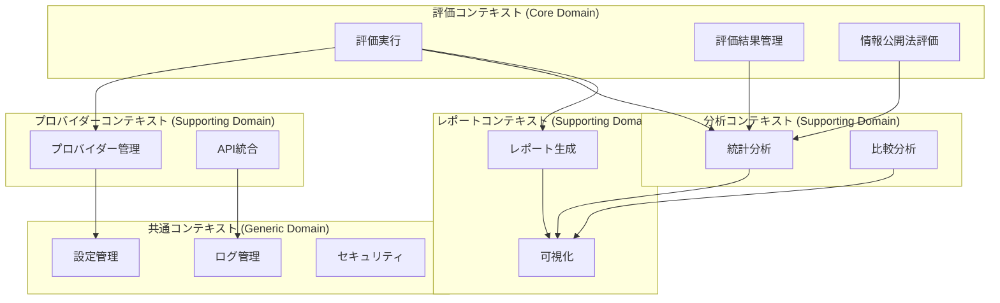

# ドメイン駆動設計（DDD）

## 📋 文書情報

| 項目       | 内容                    |
| ---------- | ----------------------- |
| 文書名     | ドメイン駆動設計（DDD） |
| バージョン | 1.0                     |
| 作成日     | 2025 年 9 月 28 日      |
| 作成者     | AI 開発チーム           |
| 承認者     | 技術責任者              |
| ステータス | 草案                    |

## 🎯 概要

Disclosure Evaluator では、ドメイン駆動設計（Domain-Driven Design, DDD）を採用し、情報公開法評価という複雑なビジネスドメインを適切にモデル化します。

## 🏗️ DDD 戦略的設計

### 1. 境界づけられたコンテキスト

#### コンテキストマップ



#### コンテキスト説明

| コンテキスト                 | タイプ            | 説明                           |
| ---------------------------- | ----------------- | ------------------------------ |
| **評価コンテキスト**         | Core Domain       | システムの核となる評価ロジック |
| **プロバイダーコンテキスト** | Supporting Domain | LLM プロバイダー統合           |
| **分析コンテキスト**         | Supporting Domain | 評価結果の分析・比較           |
| **レポートコンテキスト**     | Supporting Domain | レポート生成・可視化           |
| **共通コンテキスト**         | Generic Domain    | 横断的関心事                   |

### 2. ユビキタス言語

#### 評価コンテキストの用語

| 用語               | 定義                                         | 英語              |
| ------------------ | -------------------------------------------- | ----------------- |
| **評価**           | LLM 出力の品質を測定するプロセス             | Evaluation        |
| **評価指標**       | 品質を測定する基準                           | Evaluation Metric |
| **評価結果**       | 構造化された評価データ                       | Evaluation Result |
| **評価エンジン**   | 評価を実行するコアコンポーネント             | Evaluation Engine |
| **法的評価**       | 法的条文に基づく 6 つの不開示事由の評価      | Legal Evaluation  |
| **段階的評価**     | 3-4 段階の評価プロセス                       | Staged Evaluation |
| **重み付けスコア** | 評価指標の重要度に応じた重み付けされたスコア | Weighted Score    |

#### プロバイダーコンテキストの用語

| 用語             | 定義                            | 英語                  |
| ---------------- | ------------------------------- | --------------------- |
| **プロバイダー** | LLM サービス提供者              | Provider              |
| **API 設定**     | プロバイダー固有の API 設定情報 | API Configuration     |
| **接続管理**     | プロバイダーとの接続状態管理    | Connection Management |

## 🎨 DDD 戦術的設計

### 1. ドメインエンティティ

#### 評価エンティティ

```python
@dataclass
class Evaluation:
    """
    評価エンティティ

    情報公開法に基づく評価プロセスを表現するルートエンティティ。
    評価の実行、結果の管理、履歴の保持を担当。
    """

    id: EvaluationId
    provider_id: ProviderId
    prompt: str
    response: str
    status: EvaluationStatus
    criteria: EvaluationCriteria
    created_at: datetime
    updated_at: datetime
    results: List["EvaluationResult"] = None
    metadata: Dict[str, Any] = None

    def __post_init__(self):
        if self.results is None:
            self.results = []
        if self.metadata is None:
            self.metadata = {}

    def execute_evaluation(self, evaluation_engine: "EvaluationEngine") -> "EvaluationResult":
        """
        評価を実行し、結果を生成する

        Args:
            evaluation_engine: 評価エンジン

        Returns:
            EvaluationResult: 評価結果

        Raises:
            EvaluationError: 評価実行エラー
        """
        if self.status != "pending":
            raise EvaluationError(f"Cannot execute evaluation in status: {self.status}")

        self.status = "in_progress"
        self.updated_at = datetime.utcnow()

        try:
            result = evaluation_engine.evaluate(
                prompt=self.prompt,
                response=self.response,
                criteria=self.criteria
            )

            self.results.append(result)
            self.status = "completed"
            self.updated_at = datetime.utcnow()

            return result

        except Exception as e:
            self.status = "failed"
            self.updated_at = datetime.utcnow()
            self.metadata["error"] = str(e)
            raise EvaluationError(f"Evaluation failed: {e}") from e

    def get_latest_result(self) -> Optional["EvaluationResult"]:
        """最新の評価結果を取得"""
        return self.results[-1] if self.results else None

    def is_completed(self) -> bool:
        """評価が完了しているかチェック"""
        return self.status == "completed"
```

#### 評価指標エンティティ

```python
@dataclass
class EvaluationMetric:
    """
    評価指標エンティティ

    評価基準の定義と管理を担当。
    情報公開法の6つの不開示事由を含む多様な評価指標をサポート。
    """

    id: str
    name: str
    description: str
    metric_type: MetricType
    weight: float
    scoring_criteria: Dict[int, str]
    evaluation_prompt: str
    evaluation_steps: List[str]
    examples: List[Dict[str, Any]]
    reference_text: Optional[str] = None

    def __post_init__(self):
        self._validate()

    def _validate(self):
        """評価指標の妥当性検証"""
        if not 0.0 <= self.weight <= 1.0:
            raise ValueError(f"Weight must be between 0.0 and 1.0, got {self.weight}")

        if not all(1 <= score <= 5 for score in self.scoring_criteria.keys()):
            raise ValueError("Scoring criteria must use 1-5 scale")

        if len(self.scoring_criteria) != 5:
            raise ValueError("Must provide criteria for all 5 score levels")

    def evaluate_response(self, prompt: str, response: str, context: Dict[str, Any] = None) -> "MetricScore":
        """
        応答を評価してスコアを算出

        Args:
            prompt: 評価対象のプロンプト
            response: 評価対象の応答
            context: 追加のコンテキスト情報

        Returns:
            MetricScore: 評価スコア
        """
        # 評価ロジック実装
        pass
```

### 2. 値オブジェクト

#### スコア値オブジェクト

```python
@dataclass(frozen=True)
class Score:
    """
    評価スコア値オブジェクト

    1-5スケールの評価スコアを表現。
    不変性を保証し、スコアの妥当性を検証。
    """

    value: float
    confidence: float  # 0.0-1.0
    reasoning: str
    metadata: Optional[Dict[str, Any]] = None

    def __post_init__(self):
        if not 1.0 <= self.value <= 5.0:
            raise ValueError(f"Score must be between 1.0 and 5.0, got {self.value}")

        if not 0.0 <= self.confidence <= 1.0:
            raise ValueError(f"Confidence must be between 0.0 and 1.0, got {self.confidence}")

        if not self.reasoning.strip():
            raise ValueError("Reasoning cannot be empty")

    def is_high_confidence(self, threshold: float = 0.8) -> bool:
        """高信頼度スコアかチェック"""
        return self.confidence >= threshold

    def to_category(self) -> str:
        """スコアをカテゴリに変換"""
        if self.value >= 4.5:
            return "Excellent"
        elif self.value >= 3.5:
            return "Good"
        elif self.value >= 2.5:
            return "Fair"
        elif self.value >= 1.5:
            return "Poor"
        else:
            return "Very Poor"
```

#### 評価基準値オブジェクト

```python
@dataclass(frozen=True)
class EvaluationCriteria:
    """
    評価基準値オブジェクト

    評価に使用する基準の組み合わせを表現。
    複数の評価指標と重み付けを管理。
    """

    metrics: List[str]  # 評価指標ID
    weights: Dict[str, float]  # 指標別重み付け
    evaluation_type: str  # standard, legal, custom
    parameters: Dict[str, Any]

    def __post_init__(self):
        # 重み付けの合計が1.0になることを検証
        total_weight = sum(self.weights.values())
        if abs(total_weight - 1.0) > 0.001:
            raise ValueError(f"Weights must sum to 1.0, got {total_weight}")

        # 全ての指標に重み付けが設定されていることを検証
        if set(self.metrics) != set(self.weights.keys()):
            raise ValueError("All metrics must have corresponding weights")

    def get_weighted_score(self, scores: Dict[str, Score]) -> float:
        """重み付けされた総合スコアを計算"""
        total_score = 0.0
        total_weight = 0.0

        for metric_id, score in scores.items():
            if metric_id in self.weights:
                weight = self.weights[metric_id]
                total_score += score.value * weight
                total_weight += weight

        return total_score / total_weight if total_weight > 0 else 0.0
```

### 3. 集約ルート

#### 評価結果集約

```python
@dataclass
class EvaluationResult:
    """
    評価結果集約ルート

    評価の結果を表現する集約。
    複数の評価指標の結果を統合し、一貫性を保証。
    """

    id: EvaluationResultId
    evaluation_id: EvaluationId
    overall_score: Score
    metric_scores: Dict[str, Score]
    evaluation_type: str
    created_at: datetime
    metadata: Dict[str, Any]

    def __post_init__(self):
        self._validate_consistency()

    def _validate_consistency(self):
        """評価結果の一貫性を検証"""
        # 総合スコアと個別スコアの整合性チェック
        if not self.metric_scores:
            raise ValueError("Metric scores cannot be empty")

        # 評価タイプの妥当性チェック
        valid_types = ["standard", "legal", "custom"]
        if self.evaluation_type not in valid_types:
            raise ValueError(f"Invalid evaluation type: {self.evaluation_type}")

    def get_metric_score(self, metric_id: str) -> Optional[Score]:
        """指定された評価指標のスコアを取得"""
        return self.metric_scores.get(metric_id)

    def get_failed_metrics(self, threshold: float = 2.0) -> List[str]:
        """失敗した評価指標を取得"""
        return [
            metric_id for metric_id, score in self.metric_scores.items()
            if score.value < threshold
        ]

    def is_overall_success(self, threshold: float = 3.0) -> bool:
        """総合的な成功判定"""
        return self.overall_score.value >= threshold
```

### 4. ドメインサービス

#### 評価エンジンサービス

```python
class EvaluationEngine(ABC):
    """
    評価エンジンドメインサービス

    複雑な評価ロジックを実装し、複数の評価指標を統合して
    最終的な評価結果を生成する。
    """

    @abstractmethod
    async def evaluate(
        self,
        prompt: str,
        response: str,
        criteria: EvaluationCriteria,
        context: Dict[str, Any] = None
    ) -> "EvaluationResult":
        """評価を実行"""
        pass

    @abstractmethod
    async def batch_evaluate(
        self,
        evaluations: List[Evaluation]
    ) -> List["EvaluationResult"]:
        """バッチ評価を実行"""
        pass
```

#### 標準評価エンジン

```python
class StandardEvaluationEngine(EvaluationEngine):
    """
    標準評価エンジン実装

    7つの標準評価指標（正確性、包括性、関連性、明確性、
    有用性、一貫性、適切性）による評価を実行。
    """

    def __init__(self, llm_provider: "LLMProvider", metrics_repository: "MetricsRepository"):
        self._llm_provider = llm_provider
        self._metrics_repository = metrics_repository

    async def evaluate(
        self,
        prompt: str,
        response: str,
        criteria: EvaluationCriteria,
        context: Dict[str, Any] = None
    ) -> "EvaluationResult":
        """
        標準評価の実行

        Args:
            prompt: 評価対象のプロンプト
            response: 評価対象の応答
            criteria: 評価基準
            context: 追加のコンテキスト

        Returns:
            EvaluationResult: 評価結果
        """
        metric_scores = {}

        # 各評価指標に対して評価を実行
        for metric_id in criteria.metrics:
            metric = await self._metrics_repository.get_by_id(metric_id)
            score = await self._evaluate_metric(prompt, response, metric, context)
            metric_scores[metric_id] = score

        # 重み付け総合スコアを計算
        weighted_score = criteria.get_weighted_score(metric_scores)

        return EvaluationResult(
            overall_score=weighted_score,
            metric_scores=metric_scores,
            evaluation_type="standard",
            metadata={
                "criteria": criteria,
                "context": context or {}
            }
        )
```

### 5. ドメインイベント

#### 評価イベント

```python
@dataclass
class EvaluationStarted:
    """評価開始イベント"""
    evaluation_id: str
    provider_id: str
    criteria_type: str
    occurred_at: datetime = datetime.utcnow()

    def __post_init__(self):
        self.event_id = f"evaluation_started_{self.evaluation_id}"

@dataclass
class EvaluationCompleted:
    """評価完了イベント"""
    evaluation_id: str
    overall_score: float
    execution_time: float
    occurred_at: datetime = datetime.utcnow()

    def __post_init__(self):
        self.event_id = f"evaluation_completed_{self.evaluation_id}"

@dataclass
class EvaluationFailed:
    """評価失敗イベント"""
    evaluation_id: str
    error_message: str
    error_type: str
    occurred_at: datetime = datetime.utcnow()

    def __post_init__(self):
        self.event_id = f"evaluation_failed_{self.evaluation_id}"
```

### 6. リポジトリインターフェース

#### 評価リポジトリ

```python
class EvaluationRepository(ABC):
    """評価リポジトリインターフェース"""

    @abstractmethod
    async def save(self, evaluation: Evaluation) -> None:
        """評価を保存"""
        pass

    @abstractmethod
    async def get_by_id(self, evaluation_id: str) -> Optional[Evaluation]:
        """IDで評価を取得"""
        pass

    @abstractmethod
    async def get_by_provider(self, provider_id: str) -> List[Evaluation]:
        """プロバイダー別で評価を取得"""
        pass

    @abstractmethod
    async def get_recent_evaluations(self, limit: int = 100) -> List[Evaluation]:
        """最近の評価を取得"""
        pass

    @abstractmethod
    async def delete(self, evaluation_id: str) -> None:
        """評価を削除"""
        pass
```

## 🔄 ドメインイベント駆動設計

### 1. イベント発行

```python
class Evaluation:
    """評価エンティティ（イベント発行版）"""

    def execute_evaluation(self, evaluation_engine: "EvaluationEngine") -> "EvaluationResult":
        """評価を実行（イベント発行）"""
        # 評価開始イベントを発行
        DomainEvents.publish(EvaluationStarted(
            evaluation_id=self.id.value,
            provider_id=self.provider_id.value,
            criteria_type=self.criteria.evaluation_type
        ))

        try:
            result = evaluation_engine.evaluate(
                prompt=self.prompt,
                response=self.response,
                criteria=self.criteria
            )

            # 評価完了イベントを発行
            DomainEvents.publish(EvaluationCompleted(
                evaluation_id=self.id.value,
                overall_score=result.overall_score.value,
                execution_time=result.execution_time
            ))

            return result

        except Exception as e:
            # 評価失敗イベントを発行
            DomainEvents.publish(EvaluationFailed(
                evaluation_id=self.id.value,
                error_message=str(e),
                error_type=type(e).__name__
            ))
            raise
```

### 2. イベントハンドラー

```python
class EvaluationEventHandler:
    """評価イベントハンドラー"""

    def __init__(self, logger: StructuredLogger, metrics_collector: MetricsCollector):
        self.logger = logger
        self.metrics_collector = metrics_collector

    def handle_evaluation_started(self, event: EvaluationStarted):
        """評価開始イベントを処理"""
        self.logger.info(
            "Evaluation started",
            evaluation_id=event.evaluation_id,
            provider_id=event.provider_id,
            criteria_type=event.criteria_type
        )

        self.metrics_collector.increment_counter(
            "evaluation_attempts_total",
            labels={"status": "started", "provider": event.provider_id}
        )

    def handle_evaluation_completed(self, event: EvaluationCompleted):
        """評価完了イベントを処理"""
        self.logger.info(
            "Evaluation completed",
            evaluation_id=event.evaluation_id,
            overall_score=event.overall_score,
            execution_time=event.execution_time
        )

        self.metrics_collector.increment_counter(
            "evaluation_attempts_total",
            labels={"status": "completed", "provider": "unknown"}
        )

        self.metrics_collector.record_histogram(
            "evaluation_duration_seconds",
            event.execution_time,
            labels={"evaluation_id": event.evaluation_id}
        )
```

## 🧪 DDD テスト戦略

### 1. ドメインテスト

```python
class TestEvaluation:
    """評価エンティティのテスト"""

    def test_execute_evaluation_success(self):
        """評価実行成功のテスト"""
        # Arrange
        evaluation = Evaluation(
            id=EvaluationId.generate(),
            provider_id=ProviderId("openai"),
            prompt="テストプロンプト",
            response="テスト応答",
            status=EvaluationStatus.PENDING,
            criteria=EvaluationCriteria(
                metrics=["accuracy", "relevance"],
                weights={"accuracy": 0.6, "relevance": 0.4},
                evaluation_type="standard",
                parameters={}
            ),
            created_at=datetime.utcnow(),
            updated_at=datetime.utcnow()
        )

        mock_engine = Mock(spec=EvaluationEngine)
        mock_engine.evaluate.return_value = EvaluationResult(
            id=EvaluationResultId.generate(),
            evaluation_id=evaluation.id,
            overall_score=Score(4.0, 0.9, "Good response"),
            metric_scores={},
            evaluation_type="standard",
            created_at=datetime.utcnow(),
            metadata={}
        )

        # Act
        result = evaluation.execute_evaluation(mock_engine)

        # Assert
        assert result is not None
        assert evaluation.status == EvaluationStatus.COMPLETED
        assert len(evaluation.results) == 1
        mock_engine.evaluate.assert_called_once()

    def test_execute_evaluation_failure(self):
        """評価実行失敗のテスト"""
        # Arrange
        evaluation = Evaluation(...)
        mock_engine = Mock(spec=EvaluationEngine)
        mock_engine.evaluate.side_effect = Exception("Evaluation failed")

        # Act & Assert
        with pytest.raises(EvaluationError):
            evaluation.execute_evaluation(mock_engine)

        assert evaluation.status == EvaluationStatus.FAILED
        assert "error" in evaluation.metadata
```

### 2. 値オブジェクトテスト

```python
class TestScore:
    """スコア値オブジェクトのテスト"""

    def test_valid_score_creation(self):
        """有効なスコアの作成テスト"""
        score = Score(
            value=4.5,
            confidence=0.9,
            reasoning="明確な根拠に基づく評価"
        )

        assert score.value == 4.5
        assert score.confidence == 0.9
        assert score.reasoning == "明確な根拠に基づく評価"

    def test_invalid_score_value_raises_error(self):
        """無効なスコア値でエラーが発生することをテスト"""
        with pytest.raises(ValueError):
            Score(
                value=6.0,  # 無効な値
                confidence=0.9,
                reasoning="無効なスコア"
            )

    def test_is_high_confidence(self):
        """高信頼度判定のテスト"""
        high_confidence_score = Score(
            value=4.0,
            confidence=0.9,
            reasoning="高信頼度のスコア"
        )

        low_confidence_score = Score(
            value=4.0,
            confidence=0.6,
            reasoning="低信頼度のスコア"
        )

        assert high_confidence_score.is_high_confidence()
        assert not low_confidence_score.is_high_confidence()
```

## 📊 DDD 実装ガイドライン

### 1. エンティティ設計原則

- **一意性**: 各エンティティは一意の ID を持つ
- **ライフサイクル**: エンティティの状態遷移を明確に定義
- **不変条件**: エンティティの整合性を保つ不変条件を定義

### 2. 値オブジェクト設計原則

- **不変性**: 値オブジェクトは不変である
- **等価性**: 値による等価性判定
- **自己検証**: 作成時に妥当性を検証

### 3. 集約設計原則

- **一貫性**: 集約内の一貫性を保つ
- **境界**: 適切な集約境界を設定
- **参照**: 集約間の参照は ID による

### 4. ドメインサービス設計原則

- **無状態**: ドメインサービスは無状態である
- **純粋関数**: 副作用のない純粋関数として設計
- **テスト容易性**: モック化しやすい設計

---

_このドメイン駆動設計により、Disclosure Evaluator は複雑なビジネスロジックを適切にモデル化し、保守性の高いシステムを実現します。_
