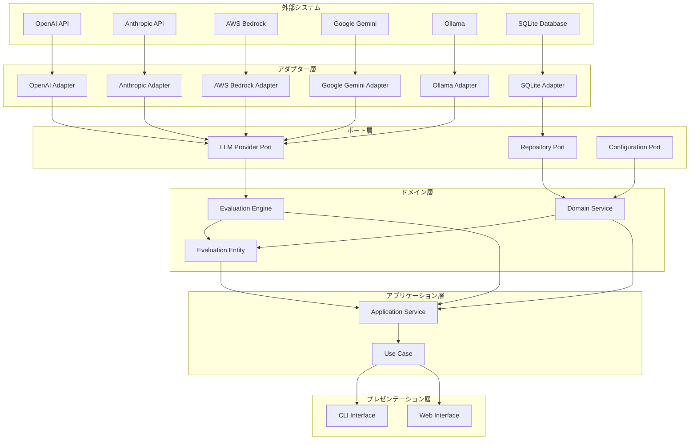

# ヘキサゴナルアーキテクチャ設計

## 📋 文書情報

| 項目       | 内容                           |
| ---------- | ------------------------------ |
| 文書名     | ヘキサゴナルアーキテクチャ設計 |
| バージョン | 1.0                            |
| 作成日     | 2025 年 9 月 28 日             |
| 作成者     | AI 開発チーム                  |
| 承認者     | 技術責任者                     |
| ステータス | 草案                           |

## 🎯 概要

Disclosure Evaluator では、ヘキサゴナルアーキテクチャ（ポート・アダプターパターン）を採用し、ドメインロジックの独立性と外部依存関係の分離を実現します。

## 🏗️ アーキテクチャ原則

### 1. ポート・アダプターパターン

**ポート（Port）**: ドメインが外部世界と通信するためのインターフェース
**アダプター（Adapter）**: ポートの具体的な実装

```python
# ポート定義（ドメイン層）
class LLMProvider(ABC):
    """LLMプロバイダーポート"""

    @abstractmethod
    async def generate_response(
        self,
        prompt: str,
        **kwargs
    ) -> ProviderResponse:
        """応答を生成"""
        pass

    @abstractmethod
    async def validate_connection(self) -> bool:
        """接続を検証"""
        pass

# アダプター実装（インフラストラクチャ層）
class OpenAIProvider(LLMProvider):
    """OpenAIプロバイダーアダプター"""

    async def generate_response(
        self,
        prompt: str,
        **kwargs
    ) -> ProviderResponse:
        # OpenAI API実装
        pass

    async def validate_connection(self) -> bool:
        # OpenAI接続検証実装
        pass
```

### 2. 依存性逆転の原則

**ドメイン層**: 外部に依存しない
**インフラストラクチャ層**: ドメイン層に依存

```python
# 依存性注入の実装
class EvaluationService:
    """評価サービス（ドメイン層）"""

    def __init__(
        self,
        llm_provider: LLMProvider,  # ポートに依存
        repository: EvaluationRepository  # ポートに依存
    ):
        self._llm_provider = llm_provider
        self._repository = repository

    async def evaluate(self, evaluation: Evaluation) -> EvaluationResult:
        # ドメインロジック実装
        pass
```

## 🎨 層構造設計

### 1. ドメイン層（Domain Layer）

**責任**: ビジネスロジックの実装

```python
# ドメインエンティティ
@dataclass
class Evaluation:
    """評価エンティティ"""
    id: EvaluationId
    prompt: str
    response: str
    status: EvaluationStatus

    def execute_evaluation(self, engine: EvaluationEngine) -> EvaluationResult:
        """評価を実行"""
        # ドメインロジック
        pass

# ドメインサービス
class EvaluationEngine:
    """評価エンジン（ドメインサービス）"""

    def __init__(self, llm_provider: LLMProvider):
        self._llm_provider = llm_provider

    async def evaluate(
        self,
        prompt: str,
        response: str
    ) -> EvaluationResult:
        """評価ロジック実装"""
        pass
```

### 2. アプリケーション層（Application Layer）

**責任**: ユースケースの実装

```python
# アプリケーションサービス
class EvaluationApplicationService:
    """評価アプリケーションサービス"""

    def __init__(
        self,
        evaluation_engine: EvaluationEngine,
        repository: EvaluationRepository
    ):
        self._evaluation_engine = evaluation_engine
        self._repository = repository

    async def execute_single_evaluation(
        self,
        request: SingleEvaluationRequest
    ) -> SingleEvaluationResponse:
        """単一評価の実行"""
        # ユースケース実装
        pass
```

### 3. インフラストラクチャ層（Infrastructure Layer）

**責任**: 外部システムとの統合

```python
# リポジトリ実装
class SQLiteEvaluationRepository(EvaluationRepository):
    """SQLite評価リポジトリ実装"""

    async def save(self, evaluation: Evaluation) -> None:
        # SQLite実装
        pass

    async def get_by_id(self, evaluation_id: str) -> Optional[Evaluation]:
        # SQLite実装
        pass

# プロバイダー実装
class AnthropicProvider(LLMProvider):
    """Anthropicプロバイダー実装"""

    async def generate_response(
        self,
        prompt: str,
        **kwargs
    ) -> ProviderResponse:
        # Anthropic API実装
        pass
```

### 4. プレゼンテーション層（Presentation Layer）

**責任**: ユーザーインターフェース

```python
# CLI実装
@click.command()
@click.option('--prompt', required=True, help='評価対象のプロンプト')
@click.option('--response', required=True, help='評価対象の応答')
@click.option('--provider', default='openai', help='使用するLLMプロバイダー')
def evaluate_single(prompt: str, response: str, provider: str):
    """単一評価の実行"""
    # CLI実装
    pass
```

## 🔌 ポート設計

### 1. LLM プロバイダーポート

```python
class LLMProvider(ABC):
    """LLMプロバイダーポート"""

    @abstractmethod
    async def generate_response(
        self,
        prompt: str,
        **kwargs
    ) -> ProviderResponse:
        """応答を生成"""
        pass

    @abstractmethod
    async def validate_connection(self) -> bool:
        """接続を検証"""
        pass

    @abstractmethod
    async def get_model_info(self) -> ModelInfo:
        """モデル情報を取得"""
        pass
```

### 2. 評価リポジトリポート

```python
class EvaluationRepository(ABC):
    """評価リポジトリポート"""

    @abstractmethod
    async def save(self, evaluation: Evaluation) -> None:
        """評価を保存"""
        pass

    @abstractmethod
    async def get_by_id(self, evaluation_id: str) -> Optional[Evaluation]:
        """IDで評価を取得"""
        pass

    @abstractmethod
    async def get_by_provider(self, provider_id: str) -> List[Evaluation]:
        """プロバイダー別で評価を取得"""
        pass
```

### 3. 設定管理ポート

```python
class ConfigurationProvider(ABC):
    """設定管理ポート"""

    @abstractmethod
    def get_provider_config(self, provider_name: str) -> Dict[str, Any]:
        """プロバイダー設定を取得"""
        pass

    @abstractmethod
    def get_evaluation_config(self) -> EvaluationConfig:
        """評価設定を取得"""
        pass

    @abstractmethod
    def get_security_config(self) -> SecurityConfig:
        """セキュリティ設定を取得"""
        pass
```

## 🔧 アダプター実装

### 1. OpenAI アダプター

```python
class OpenAIProvider(LLMProvider):
    """OpenAIプロバイダーアダプター"""

    def __init__(self, config: Dict[str, Any]):
        self.config = config
        self.client = openai.AsyncOpenAI(
            api_key=config['api_key'],
            base_url=config.get('base_url')
        )

    async def generate_response(
        self,
        prompt: str,
        **kwargs
    ) -> ProviderResponse:
        """OpenAI APIを使用して応答を生成"""
        try:
            response = await self.client.chat.completions.create(
                model=self.config['model'],
                messages=[{"role": "user", "content": prompt}],
                **kwargs
            )

            return ProviderResponse(
                content=response.choices[0].message.content,
                model=response.model,
                usage=response.usage,
                metadata={
                    "provider": "openai",
                    "model": response.model,
                    "finish_reason": response.choices[0].finish_reason
                }
            )
        except Exception as e:
            raise ProviderConnectionError(f"OpenAI API error: {e}")

    async def validate_connection(self) -> bool:
        """OpenAI接続を検証"""
        try:
            await self.client.models.list()
            return True
        except Exception:
            return False
```

### 2. Anthropic アダプター

```python
class AnthropicProvider(LLMProvider):
    """Anthropicプロバイダーアダプター"""

    def __init__(self, config: Dict[str, Any]):
        self.config = config
        self.client = anthropic.AsyncAnthropic(
            api_key=config['api_key']
        )

    async def generate_response(
        self,
        prompt: str,
        **kwargs
    ) -> ProviderResponse:
        """Anthropic APIを使用して応答を生成"""
        try:
            response = await self.client.messages.create(
                model=self.config['model'],
                max_tokens=self.config.get('max_tokens', 4000),
                messages=[{"role": "user", "content": prompt}],
                **kwargs
            )

            return ProviderResponse(
                content=response.content[0].text,
                model=response.model,
                usage=response.usage,
                metadata={
                    "provider": "anthropic",
                    "model": response.model,
                    "stop_reason": response.stop_reason
                }
            )
        except Exception as e:
            raise ProviderConnectionError(f"Anthropic API error: {e}")
```

### 3. SQLite リポジトリアダプター

```python
class SQLiteEvaluationRepository(EvaluationRepository):
    """SQLite評価リポジトリアダプター"""

    def __init__(self, db_path: str):
        self.db_path = db_path
        self._ensure_tables()

    async def save(self, evaluation: Evaluation) -> None:
        """評価をSQLiteに保存"""
        async with aiosqlite.connect(self.db_path) as db:
            await db.execute(
                """
                INSERT OR REPLACE INTO evaluations
                (id, prompt, response, status, created_at, updated_at)
                VALUES (?, ?, ?, ?, ?, ?)
                """,
                (
                    evaluation.id.value,
                    evaluation.prompt,
                    evaluation.response,
                    evaluation.status.value,
                    evaluation.created_at.isoformat(),
                    evaluation.updated_at.isoformat()
                )
            )
            await db.commit()

    async def get_by_id(self, evaluation_id: str) -> Optional[Evaluation]:
        """IDで評価を取得"""
        async with aiosqlite.connect(self.db_path) as db:
            cursor = await db.execute(
                "SELECT * FROM evaluations WHERE id = ?",
                (evaluation_id,)
            )
            row = await cursor.fetchone()

            if row:
                return self._row_to_evaluation(row)
            return None
```

## 🔄 依存性注入

### 1. 依存性注入コンテナ

```python
class DIContainer:
    """依存性注入コンテナ"""

    def __init__(self):
        self._services = {}
        self._singletons = {}

    def register_singleton(self, interface: Type, implementation: Type):
        """シングルトンサービスを登録"""
        self._singletons[interface] = implementation

    def register_transient(self, interface: Type, implementation: Type):
        """トランジェントサービスを登録"""
        self._services[interface] = implementation

    def get(self, interface: Type):
        """サービスを取得"""
        if interface in self._singletons:
            if interface not in self._singletons:
                self._singletons[interface] = self._singletons[interface]()
            return self._singletons[interface]

        if interface in self._services:
            return self._services[interface]()

        raise ValueError(f"Service {interface} not registered")

# コンテナ設定
def configure_container() -> DIContainer:
    """依存性注入コンテナを設定"""
    container = DIContainer()

    # リポジトリ登録
    container.register_singleton(
        EvaluationRepository,
        lambda: SQLiteEvaluationRepository("evaluations.db")
    )

    # プロバイダー登録
    container.register_transient(
        LLMProvider,
        lambda: OpenAIProvider(get_openai_config())
    )

    return container
```

### 2. アプリケーションサービス設定

```python
class ApplicationServiceFactory:
    """アプリケーションサービスファクトリー"""

    def __init__(self, container: DIContainer):
        self.container = container

    def create_evaluation_service(self) -> EvaluationApplicationService:
        """評価サービスを作成"""
        return EvaluationApplicationService(
            evaluation_engine=self.container.get(EvaluationEngine),
            repository=self.container.get(EvaluationRepository)
        )
```

## 🧪 テスタビリティ

### 1. モックアダプター

```python
class MockLLMProvider(LLMProvider):
    """モックLLMプロバイダー"""

    def __init__(self, responses: Dict[str, str]):
        self.responses = responses
        self.call_count = 0

    async def generate_response(
        self,
        prompt: str,
        **kwargs
    ) -> ProviderResponse:
        """モック応答を生成"""
        self.call_count += 1

        # プロンプトに基づく応答選択
        response_content = self.responses.get(prompt, "Default mock response")

        return ProviderResponse(
            content=response_content,
            model="mock-model",
            usage={"total_tokens": 100},
            metadata={"provider": "mock", "call_count": self.call_count}
        )

    async def validate_connection(self) -> bool:
        """常に成功を返す"""
        return True
```

### 2. インメモリリポジトリ

```python
class InMemoryEvaluationRepository(EvaluationRepository):
    """インメモリ評価リポジトリ"""

    def __init__(self):
        self._evaluations: Dict[str, Evaluation] = {}

    async def save(self, evaluation: Evaluation) -> None:
        """評価をメモリに保存"""
        self._evaluations[evaluation.id.value] = evaluation

    async def get_by_id(self, evaluation_id: str) -> Optional[Evaluation]:
        """IDで評価を取得"""
        return self._evaluations.get(evaluation_id)
```

## 📊 アーキテクチャ図

### ヘキサゴナルアーキテクチャ図



## 🔧 実装ガイドライン

### 1. ポート設計原則

- **単一責任**: 各ポートは単一の責任を持つ
- **インターフェース分離**: 必要最小限のメソッドのみ公開
- **依存性逆転**: ドメイン層が外部に依存しない

### 2. アダプター実装原則

- **エラーハンドリング**: 外部システムのエラーを適切に処理
- **リトライ機能**: 一時的な障害に対するリトライ
- **ログ記録**: 外部システムとの通信ログを記録

### 3. テスト戦略

- **ユニットテスト**: 各アダプターの個別テスト
- **統合テスト**: ポートとアダプターの統合テスト
- **モックテスト**: 外部システムのモック化

---

_このヘキサゴナルアーキテクチャ設計により、Disclosure Evaluator は柔軟で保守性の高いシステムを実現します。_
