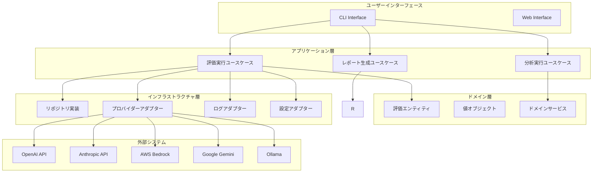
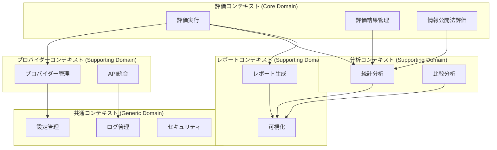
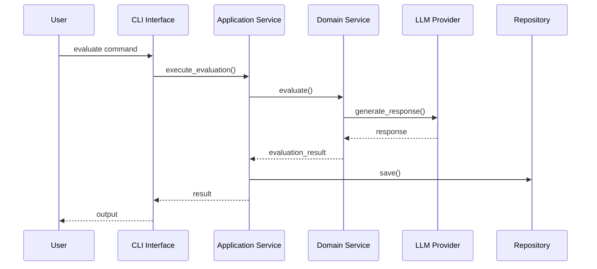

# アーキテクチャ概要

## 📋 文書情報

| 項目       | 内容                                    |
| ---------- | --------------------------------------- |
| 文書名     | Disclosure Evaluator アーキテクチャ概要 |
| バージョン | 1.0                                     |
| 作成日     | 2025 年 9 月 28 日                      |
| 作成者     | AI 開発チーム                           |
| 承認者     | 技術責任者                              |
| ステータス | 草案                                    |

## 🎯 概要

Disclosure Evaluator は、情報公開法準拠の LLM 評価システムです。ヘキサゴナルアーキテクチャとドメイン駆動設計（DDD）を基盤として、多様な LLM プロバイダーに対応した構造化評価システムを提供します。

## 🏗️ アーキテクチャ原則

### 1. ヘキサゴナルアーキテクチャ（ポート・アダプターパターン）

**目的**: ドメインロジックの独立性確保と外部依存関係の分離

**実装方針**:

```python
# ポート（インターフェース）の定義
class LLMProvider(ABC):
    @abstractmethod
    async def generate_response(self, prompt: str) -> str:
        pass

# アダプター（実装）の定義
class OpenAIProvider(LLMProvider):
    async def generate_response(self, prompt: str) -> str:
        # OpenAI API実装
        pass
```

**理由**:

- ドメインロジックの独立性確保
- 外部依存関係の分離（LLM プロバイダー、データストレージ）
- テスタビリティの向上
- 将来の技術変更への対応

### 2. Clean Architecture + DDD の統合

**決定**: Clean Architecture の層構造と DDD の戦略的設計を統合

**理由**:

- 境界づけられたコンテキストの明確な分離
- ドメインロジックのビジネス価値最大化
- 技術的関心事とビジネス関心事の分離

**層構造**:

```
┌─────────────────────────────────────────┐
│            Presentation Layer           │
│         (CLI, Web API, etc.)            │
├─────────────────────────────────────────┤
│           Application Layer             │
│      (Use Cases, Application Services)  │
├─────────────────────────────────────────┤
│             Domain Layer                │
│    (Entities, Value Objects, Services)  │
├─────────────────────────────────────────┤
│         Infrastructure Layer            │
│   (Repositories, External Services)     │
└─────────────────────────────────────────┘
```

## 🎨 システムコンポーネント

### 高レベルコンポーネント図



## 🔧 技術スタック

### コア技術スタック

| レイヤー               | 技術              | バージョン | 理由                                   |
| ---------------------- | ----------------- | ---------- | -------------------------------------- |
| **言語**               | Python            | 3.11+      | 型安全性、非同期処理、豊富なライブラリ |
| **CLI フレームワーク** | Typer             | 0.9+       | 型安全、自動ヘルプ生成、FastAPI 統合   |
| **非同期処理**         | asyncio + aiohttp | 3.11+      | 高性能並列処理                         |
| **データ検証**         | Pydantic          | 2.0+       | 型安全なデータモデル                   |
| **LLM 統合**           | LangChain         | 0.1+       | マルチプロバイダー対応                 |
| **データ処理**         | Pandas + Polars   | 2.0+       | 高性能データ処理                       |
| **可視化**             | Plotly            | 5.17+      | インタラクティブ可視化                 |
| **設定管理**           | Dynaconf          | 3.2+       | 環境別設定管理                         |

### 品質保証スタック

| カテゴリ         | ツール   | 目的                   |
| ---------------- | -------- | ---------------------- |
| **型チェック**   | mypy     | 静的型チェック         |
| **リンター**     | ruff     | コード品質・スタイル   |
| **セキュリティ** | bandit   | セキュリティ脆弱性検出 |
| **テスト**       | pytest   | 単体・統合テスト       |
| **カバレッジ**   | coverage | テストカバレッジ測定   |
| **複雑度**       | radon    | コード複雑度分析       |

## 🎯 境界づけられたコンテキスト

### コンテキストマップ



### コンテキスト説明

| コンテキスト                 | タイプ            | 説明                           |
| ---------------------------- | ----------------- | ------------------------------ |
| **評価コンテキスト**         | Core Domain       | システムの核となる評価ロジック |
| **プロバイダーコンテキスト** | Supporting Domain | LLM プロバイダー統合           |
| **分析コンテキスト**         | Supporting Domain | 評価結果の分析・比較           |
| **レポートコンテキスト**     | Supporting Domain | レポート生成・可視化           |
| **共通コンテキスト**         | Generic Domain    | 横断的関心事                   |

## 🔄 データフロー

### 評価実行フロー



## 🛡️ 非機能要件

### パフォーマンス要件

| 指標             | 目標値       | 測定方法         |
| ---------------- | ------------ | ---------------- |
| **応答時間**     | < 30 秒/評価 | 平均応答時間     |
| **スループット** | 100 評価/分  | 同時実行数       |
| **メモリ使用量** | < 2GB        | 最大メモリ使用量 |
| **CPU 使用率**   | < 80%        | 平均 CPU 使用率  |

### 可用性要件

| 指標           | 目標値   | 測定方法     |
| -------------- | -------- | ------------ |
| **稼働率**     | 99.9%    | 月次稼働率   |
| **復旧時間**   | < 4 時間 | 平均復旧時間 |
| **データ損失** | 0%       | データ整合性 |

### セキュリティ要件

| 要件             | 実装方法     | 検証方法   |
| ---------------- | ------------ | ---------- |
| **データ暗号化** | AES-256      | 暗号化検証 |
| **通信暗号化**   | TLS 1.3      | 証明書検証 |
| **アクセス制御** | ファイル権限 | 権限監査   |
| **監査ログ**     | 構造化ログ   | ログ分析   |

## 📊 監視・観測性

### メトリクス設計

```python
# カスタムメトリクス例
evaluation_attempts_total = Counter(
    'evaluation_attempts_total',
    'Total number of evaluation attempts',
    ['provider', 'status']
)

evaluation_duration_seconds = Histogram(
    'evaluation_duration_seconds',
    'Time spent on evaluations',
    ['provider', 'evaluation_type']
)
```

### ログ設計

```python
# 構造化ログ例
{
    "timestamp": "2025-09-28T10:30:00Z",
    "level": "INFO",
    "service": "disclosure-evaluator",
    "component": "evaluation_engine",
    "correlation_id": "eval_12345",
    "message": "Evaluation completed",
    "evaluation_id": "eval_12345",
    "provider": "openai",
    "duration_ms": 2500,
    "status": "success"
}
```

## 🚀 デプロイメント戦略

### 環境構成

| 環境                 | 目的             | 設定                       |
| -------------------- | ---------------- | -------------------------- |
| **開発環境**         | 開発・テスト     | ローカル実行、デバッグ有効 |
| **ステージング環境** | 統合テスト・検証 | 本番同等設定               |
| **本番環境**         | 本番運用         | 高可用性、監視強化         |

### CI/CD パイプライン

```yaml
# GitHub Actions ワークフロー例
name: CI/CD Pipeline
on: [push, pull_request]

jobs:
  test:
    runs-on: ubuntu-latest
    steps:
      - name: Run tests
        run: pytest tests/
      - name: Type check
        run: mypy src/
      - name: Security scan
        run: bandit -r src/

  deploy:
    needs: test
    if: github.ref == 'refs/heads/main'
    steps:
      - name: Deploy to production
        run: ./deploy.sh
```

## 📈 スケーラビリティ設計

### 水平スケーリング

- **プロセス分離**: 評価プロセスの独立実行
- **非同期処理**: asyncio による並列処理
- **キューイング**: 大量評価のキュー管理

### 垂直スケーリング

- **メモリ最適化**: 効率的なデータ構造使用
- **CPU 最適化**: 並列処理による CPU 活用
- **I/O 最適化**: 非同期 I/O による効率化

## 🔧 運用設計

### ヘルスチェック

```python
# ヘルスチェック実装例
@app.get("/health")
async def health_check():
    return {
        "status": "healthy",
        "timestamp": datetime.utcnow().isoformat(),
        "version": "1.0.0",
        "dependencies": {
            "database": "connected",
            "llm_providers": "available"
        }
    }
```

### 監視・アラート

| 指標             | 閾値    | アラート条件      |
| ---------------- | ------- | ----------------- |
| **エラー率**     | > 5%    | 5 分間平均        |
| **応答時間**     | > 60 秒 | 95 パーセンタイル |
| **メモリ使用量** | > 90%   | 5 分間継続        |
| **CPU 使用率**   | > 95%   | 5 分間継続        |

---

_このアーキテクチャ概要は、Disclosure Evaluator システムの設計基盤を提供します。詳細な実装については、各専門ドキュメントを参照してください。_
