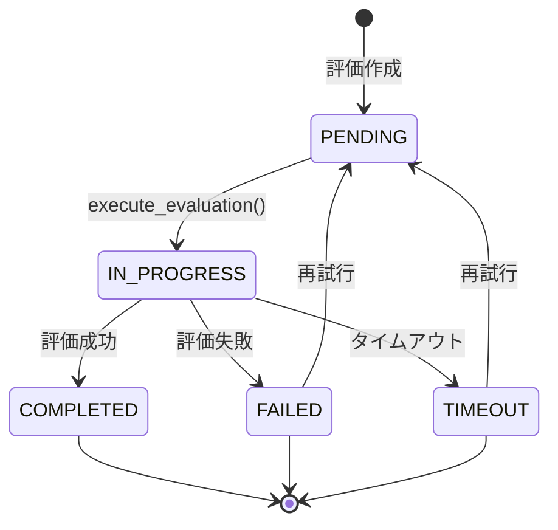

# 評価エンティティ設計

## 📋 文書情報

| 項目       | 内容                 |
| ---------- | -------------------- |
| 文書名     | 評価エンティティ設計 |
| バージョン | 1.0                  |
| 作成日     | 2025 年 9 月 28 日   |
| 作成者     | AI 開発チーム        |
| 承認者     | 技術責任者           |
| ステータス | 草案                 |

## 🎯 概要

評価エンティティは、Disclosure Evaluator システムの核となるドメインエンティティです。LLM 出力の評価プロセスを表現し、評価の実行、結果の管理、履歴の保持を担当します。

## 🏗️ エンティティ設計

### 1. 基本構造

```python
@dataclass
class Evaluation:
    """
    評価エンティティ

    情報公開法に基づく評価プロセスを表現するルートエンティティ。
    評価の実行、結果の管理、履歴の保持を担当。
    """

    id: EvaluationId
    provider_id: ProviderId
    prompt: str
    response: str
    status: EvaluationStatus
    criteria: EvaluationCriteria
    created_at: datetime
    updated_at: datetime
    results: List["EvaluationResult"] = None
    metadata: Dict[str, Any] = None

    def __post_init__(self):
        if self.results is None:
            self.results = []
        if self.metadata is None:
            self.metadata = {}
```

### 2. 属性説明

| 属性名          | 型                     | 説明                         |
| --------------- | ---------------------- | ---------------------------- |
| **id**          | EvaluationId           | 評価の一意識別子             |
| **provider_id** | ProviderId             | 使用する LLM プロバイダー ID |
| **prompt**      | str                    | 評価対象のプロンプト         |
| **response**    | str                    | 評価対象の応答               |
| **status**      | EvaluationStatus       | 評価の現在の状態             |
| **criteria**    | EvaluationCriteria     | 評価に使用する基準           |
| **created_at**  | datetime               | 作成日時                     |
| **updated_at**  | datetime               | 最終更新日時                 |
| **results**     | List[EvaluationResult] | 評価結果の履歴               |
| **metadata**    | Dict[str, Any]         | 追加のメタデータ             |

## 🔄 ビジネスロジック

### 1. 評価実行

```python
def execute_evaluation(self, evaluation_engine: "EvaluationEngine") -> "EvaluationResult":
    """
    評価を実行し、結果を生成する

    Args:
        evaluation_engine: 評価エンジン

    Returns:
        EvaluationResult: 評価結果

    Raises:
        EvaluationError: 評価実行エラー
    """
    if self.status != "pending":
        raise EvaluationError(f"Cannot execute evaluation in status: {self.status}")

    self.status = "in_progress"
    self.updated_at = datetime.utcnow()

    try:
        result = evaluation_engine.evaluate(
            prompt=self.prompt,
            response=self.response,
            criteria=self.criteria
        )

        self.results.append(result)
        self.status = "completed"
        self.updated_at = datetime.utcnow()

        return result

    except Exception as e:
        self.status = "failed"
        self.updated_at = datetime.utcnow()
        self.metadata["error"] = str(e)
        raise EvaluationError(f"Evaluation failed: {e}") from e
```

### 2. 状態管理

```python
def get_latest_result(self) -> Optional["EvaluationResult"]:
    """最新の評価結果を取得"""
    return self.results[-1] if self.results else None

def is_completed(self) -> bool:
    """評価が完了しているかチェック"""
    return self.status == "completed"

def is_failed(self) -> bool:
    """評価が失敗しているかチェック"""
    return self.status == "failed"

def can_retry(self) -> bool:
    """評価を再試行できるかチェック"""
    return self.status in ["failed", "timeout"]
```

### 3. 履歴管理

```python
def add_result(self, result: "EvaluationResult") -> None:
    """評価結果を追加"""
    self.results.append(result)
    self.updated_at = datetime.utcnow()

def get_result_history(self) -> List["EvaluationResult"]:
    """評価結果の履歴を取得"""
    return self.results.copy()

def get_result_count(self) -> int:
    """評価結果の数を取得"""
    return len(self.results)
```

## 🎨 状態遷移

### 状態遷移図



### 状態説明

| 状態            | 説明             | 遷移可能な状態             |
| --------------- | ---------------- | -------------------------- |
| **PENDING**     | 評価待機中       | IN_PROGRESS                |
| **IN_PROGRESS** | 評価実行中       | COMPLETED, FAILED, TIMEOUT |
| **COMPLETED**   | 評価完了         | -                          |
| **FAILED**      | 評価失敗         | PENDING (再試行時)         |
| **TIMEOUT**     | 評価タイムアウト | PENDING (再試行時)         |

## 🧪 テスト設計

### 1. 単体テスト

```python
class TestEvaluation:
    """評価エンティティのテスト"""

    @pytest.fixture
    def evaluation(self):
        """テスト用評価エンティティ"""
        return Evaluation(
            id=EvaluationId.generate(),
            provider_id=ProviderId("openai"),
            prompt="テストプロンプト",
            response="テスト応答",
            status=EvaluationStatus.PENDING,
            criteria=EvaluationCriteria(
                metrics=["accuracy", "relevance"],
                weights={"accuracy": 0.6, "relevance": 0.4},
                evaluation_type="standard",
                parameters={}
            ),
            created_at=datetime.utcnow(),
            updated_at=datetime.utcnow()
        )

    def test_execute_evaluation_success(self, evaluation):
        """評価実行成功のテスト"""
        # Arrange
        mock_engine = Mock(spec=EvaluationEngine)
        mock_result = EvaluationResult(
            id=EvaluationResultId.generate(),
            evaluation_id=evaluation.id,
            overall_score=Score(4.0, 0.9, "Good response"),
            metric_scores={},
            evaluation_type="standard",
            created_at=datetime.utcnow(),
            metadata={}
        )
        mock_engine.evaluate.return_value = mock_result

        # Act
        result = evaluation.execute_evaluation(mock_engine)

        # Assert
        assert result == mock_result
        assert evaluation.status == EvaluationStatus.COMPLETED
        assert len(evaluation.results) == 1
        assert evaluation.results[0] == mock_result
        mock_engine.evaluate.assert_called_once_with(
            prompt=evaluation.prompt,
            response=evaluation.response,
            criteria=evaluation.criteria
        )

    def test_execute_evaluation_failure(self, evaluation):
        """評価実行失敗のテスト"""
        # Arrange
        mock_engine = Mock(spec=EvaluationEngine)
        mock_engine.evaluate.side_effect = Exception("Evaluation failed")

        # Act & Assert
        with pytest.raises(EvaluationError):
            evaluation.execute_evaluation(mock_engine)

        assert evaluation.status == EvaluationStatus.FAILED
        assert "error" in evaluation.metadata
        assert len(evaluation.results) == 0

    def test_cannot_execute_in_wrong_status(self, evaluation):
        """不正な状態での評価実行をテスト"""
        # Arrange
        evaluation.status = EvaluationStatus.COMPLETED
        mock_engine = Mock(spec=EvaluationEngine)

        # Act & Assert
        with pytest.raises(EvaluationError):
            evaluation.execute_evaluation(mock_engine)

        mock_engine.evaluate.assert_not_called()

    def test_get_latest_result(self, evaluation):
        """最新結果取得のテスト"""
        # Arrange
        result1 = Mock(spec=EvaluationResult)
        result2 = Mock(spec=EvaluationResult)
        evaluation.results = [result1, result2]

        # Act
        latest = evaluation.get_latest_result()

        # Assert
        assert latest == result2

    def test_is_completed(self, evaluation):
        """完了状態チェックのテスト"""
        # Test pending
        assert not evaluation.is_completed()

        # Test completed
        evaluation.status = EvaluationStatus.COMPLETED
        assert evaluation.is_completed()

        # Test failed
        evaluation.status = EvaluationStatus.FAILED
        assert not evaluation.is_completed()
```

### 2. 統合テスト

```python
class TestEvaluationIntegration:
    """評価エンティティの統合テスト"""

    @pytest.fixture
    async def real_evaluation_engine(self):
        """実際の評価エンジン"""
        from disclosure_evaluator.domain.services.evaluation_engine import StandardEvaluationEngine
        from disclosure_evaluator.infrastructure.adapters.openai_provider import OpenAIProvider

        provider = OpenAIProvider({
            "api_key": "test-key",
            "model": "gpt-3.5-turbo"
        })

        metrics_repo = Mock()
        metrics_repo.get_by_id.return_value = EvaluationMetric(
            id="accuracy",
            name="正確性",
            description="回答の正確性を評価",
            metric_type=MetricType.STANDARD,
            weight=0.5,
            scoring_criteria={1: "不正確", 2: "やや不正確", 3: "普通", 4: "正確", 5: "非常に正確"},
            evaluation_prompt="回答の正確性を評価してください",
            evaluation_steps=["1. 事実確認", "2. 論理的整合性確認"],
            examples=[]
        )

        return StandardEvaluationEngine(provider, metrics_repo)

    async def test_evaluation_with_real_engine(self, real_evaluation_engine):
        """実際のエンジンを使用した評価テスト"""
        # Arrange
        evaluation = Evaluation(
            id=EvaluationId.generate(),
            provider_id=ProviderId("openai"),
            prompt="What is the capital of Japan?",
            response="The capital of Japan is Tokyo.",
            status=EvaluationStatus.PENDING,
            criteria=EvaluationCriteria(
                metrics=["accuracy"],
                weights={"accuracy": 1.0},
                evaluation_type="standard",
                parameters={}
            ),
            created_at=datetime.utcnow(),
            updated_at=datetime.utcnow()
        )

        # Act
        result = evaluation.execute_evaluation(real_evaluation_engine)

        # Assert
        assert result is not None
        assert evaluation.status == EvaluationStatus.COMPLETED
        assert len(evaluation.results) == 1
        assert result.overall_score.value > 0
```

## 🔧 実装ガイドライン

### 1. エンティティ設計原則

- **一意性**: 各評価は一意の ID を持つ
- **不変条件**: 評価の状態遷移ルールを厳守
- **ビジネスロジック**: ドメインロジックをエンティティ内に集約

### 2. 状態管理原則

- **原子性**: 状態遷移は原子的に行う
- **一貫性**: 状態と結果の整合性を保つ
- **永続性**: 状態変更は永続化される

### 3. エラーハンドリング

- **例外処理**: 適切な例外を発生させる
- **状態復旧**: 失敗時の状態復旧を考慮
- **ログ記録**: 重要な状態変更をログに記録

## 📊 パフォーマンス考慮事項

### 1. メモリ使用量

- **結果履歴**: 大量の結果履歴によるメモリ使用量増加
- **メタデータ**: メタデータのサイズ制限
- **遅延読み込み**: 必要時のみ結果を読み込み

### 2. 処理時間

- **評価実行**: 評価実行時間の最適化
- **状態更新**: 状態更新の効率化
- **履歴管理**: 履歴操作の最適化

## 🔄 将来の拡張性

### 1. 新しい評価タイプ

- **カスタム評価**: ユーザー定義の評価基準
- **複合評価**: 複数の評価タイプの組み合わせ
- **段階的評価**: 段階的な評価プロセス

### 2. 高度な状態管理

- **並列評価**: 複数の評価の並列実行
- **評価チェーン**: 評価結果に基づく追加評価
- **条件分岐**: 条件に基づく評価分岐

---

_この評価エンティティ設計により、Disclosure Evaluator は柔軟で拡張性の高い評価システムを実現します。_
